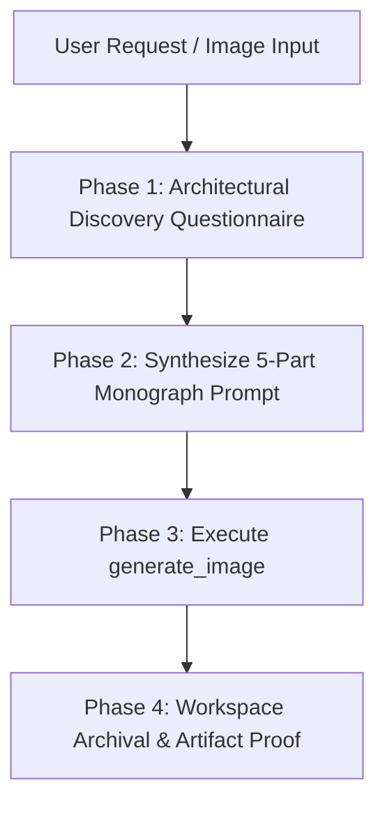

# Ultra Image Generator Skill

## Purpose
The **Ultra Image Generator Skill** produces editorial-grade, monograph-standard architectural photographs that are indistinguishable from real-life camera captures. It systematically avoids the "synthetic CGI / video game" look common in AI-generated renders by enforcing real-world camera optics, construction micro-imperfections, botanical authenticity, and physical lighting dynamics.

---

## Skill Trigger Conditions
Activate this skill whenever:
* The user asks to generate a "high quality", "realistic", or "photorealistic" render or photo of a building, room, facade, or site.
* The user provides a CAD screenshot, wireframe, floor plan, or draft render and asks to elevate or re-render it.
* The user invokes `/ultra-image`, `/render`, or asks for the "most realistic version".
* The user requests marketing, council submission, or client presentation visuals for any takeoff or project model.

---

## Standard Workflow

---

### Phase 1: Architectural Discovery Questionnaire

Before generating, check if the user has provided:
1. **Building typology & form** (storeys, roof style, carports, cantilevers, openings).
2. **Materials & finishes** (roof sheets, brick/concrete/cladding, mortar, window frames, paving).
3. **Landscape & site context** (topography, regional flora, soil/retaining walls).
4. **Lighting & atmosphere** (golden hour, crisp morning daylight, overcast soft-box, twilight).
5. **Reference media** (CAD screenshots, 3D viewer renders, floor plans).

If any key element is missing or ambiguous, use the `ask_question` tool or an interactive prompt using [templates/questionnaire.md](./templates/questionnaire.md).

---

### Phase 2: Synthesize the 5-Part Monograph Prompt

Follow the proven formula documented in [references/prompt-formula.md](./references/prompt-formula.md):

1. **Camera Hardware & Optics:**
   * Body: `Hasselblad H6D-100c medium format camera` or `Fujifilm GFX 100 II`.
   * Lens: `35mm tilt-shift architectural lens, f/8 aperture`.
   * Perspective: `Two-point architectural perspective, perfectly straight vertical lines, zero keystoning distortion`.
2. **Explicit Anti-CGI Directives:**
   * `A completely genuine, indistinguishable from reality, raw photograph published in an architectural monograph. Zero CGI feel, no 3D rendering artifacts, no video game gloss, natural chromatic balance.`
3. **Construction Micro-Imperfections:**
   * Specific jointing, laps, and fastenings (e.g. `corrugated Colorbond roof with sheet lap seams, ridge capping, gutters, downpipes`, `kiln-fired brick with tonal variation and tactile mortar beds`, `saw-cut aggregate expansion joints`).
4. **Botanical & Environmental Authenticity:**
   * Exact regional species (e.g. `mature Australian eucalyptus gum trees with organic branches and peeling bark`, `natural turf with thatch density`, `board-formed concrete retaining wall`).
5. **Natural Lighting Physics:**
   * Natural daylight with realistic ground bounce, soft shadow falloff under eaves, and authentic double-glazed window reflections with interior room depth.

*Refer to [examples/sample-prompts.md](./examples/sample-prompts.md) for tested archetype prompts.*

---

### Phase 3: Execute `generate_image`

Call the `generate_image` tool:
* `Prompt`: The synthesized 5-part monograph prompt.
* `ImageName`: 2-3 words, lowercase with underscores (e.g. `house_photorealistic_hero`).
* `AspectRatio`: 
  * `16:9` for wide landscape and exterior streetscapes.
  * `4:3` or `3:2` for standard architectural plates.
  * `9:16` for vertical facades, high-rises, or mobile formats.
* `ImagePaths`: Array of absolute paths to reference images (up to 3 files, e.g. CAD model screenshot, wireframe render, existing draft).

---

### Phase 4: Workspace Archival & Visual Verification

1. **Save High-Resolution Copy into Project Workspace:**
   * Copy the generated image from `<appDataDir>\brain\<conversation-id>\` into `public/images/promo/` or project assets folder so it is permanently preserved.
2. **Create or Update Showcase Artifact:**
   * Create an artifact markdown document in the conversation brain folder (`realistic_architectural_render.md`).
   * Embed the image using ``.
   * Include a bulleted breakdown of optical and material realism features.
3. **Present Clickable Workspace Links:**
   * Provide the user with direct `file:///` markdown links to the saved file and artifact.
