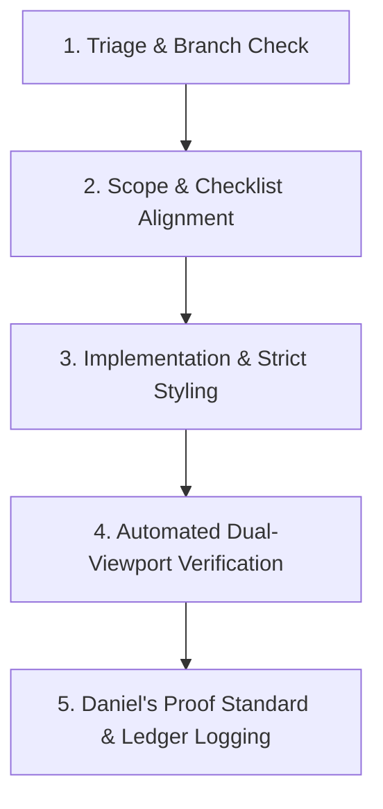

# X-Ray Engine Skill

## Golden invariant

> Nothing is deemed complete without BOTH an exact code diff and visual or executed proof.

This is Daniel's non-negotiable proof standard.

A task is incomplete unless the evidence required by its change category is produced,
reviewed, and recorded.

## Prime directive

> Unproven numbers are not estimates—they are hallucinations.

Never present inferred, sample, approximate, or uncalibrated geometry as verified
construction data, certified measurement, takeoff quantity, quote input, or price-book
quantity.

## Skill trigger conditions

Activate this skill for any task involving one or more of:

- Architectural plan reconstruction.
- PDF, DXF, DWG, SVG, IFC, or drawing-sheet provenance.
- Three.js, WebGL, shaders, raycasting, scenes, cameras, meshes, clipping, or rendering.
- SourceBuildingViewer.tsx, MagicPencilDraftsman.ts, draftsmanBridge.ts, calibration.ts.
- Storeys, levels, walls, slabs, roofs, openings, component registers, or IFC-like objects.
- Takeoff, BOQ, BOM, quantities, calibration, price books, supplier rates, or quote drafting.
- MCP tools, agent actions, remote drafting controls, Zod validation, or DOM bridge events.
- UI verification, screenshots, Playwright, CDP, fast-cdp-test.mjs, mobile responsiveness.
- IndexedDB project persistence, plan import, markups, or document source state.
- Build server ports 8080 or 8081.

## Mandatory rule order

When instructions conflict, apply them in this order:

1. Evidence integrity and source provenance.
2. Human safety and engineering honesty.
3. Data-loss prevention and Git hygiene.
4. Existing product contracts and tests.
5. Visual/design requirements.
6. Feature speed and convenience.

Never trade provenance, calibration status, source identity, or test proof for visual polish.

## Required first actions

Before implementation:

1. Inspect the repository and identify the relevant files.
2. Run `git branch --show-current`.
3. Run `git status --short`.
4. Determine whether the task changes:
   - UI / visual / 3D rendering
   - logic / math / parsing
   - data schema / provenance
   - takeoff / pricing / quote logic
   - MCP / remote assistant controls
   - server / persistence / infrastructure
5. Locate the checklist requirement ID in:
   - `PROFESSIONAL-A-Z-CHECKLIST.md`, or
   - `COMPLETE-CHECKLIST.md`.
6. Read the applicable reference documents before editing code.
7. Check port ownership before starting a server:
   - development server: `0.0.0.0:8080`
   - production preview: `127.0.0.1:8081`

## Git hygiene

- Never run `git add -A`.
- Never run `git add .`.
- Stage explicit file paths only.
- Never create a rogue worktree.
- Do not reset, clean, delete, force-push, rebase, amend, or overwrite user work unless
  specifically instructed.
- Do not modify unrelated files.
- Preserve the user’s existing working-tree changes.
- Report all changed files at the end of the task.

Use explicit staging only:

```bash
git add path/to/file-a path/to/file-b
```

## Definition of complete

### UI, visual, interaction, responsive, or 3D change

Completion requires all applicable evidence:

- Exact code diff.
- Desktop proof at `1280x800` or `1440x900`.
- iOS proof at `390x844` with touch emulation.
- No horizontal mobile overflow.
- Touch targets at least 44 px where interactive.
- No unhandled browser console errors.
- No page crash.
- No hydration mismatch warning.
- A ledger entry in `walkthrough.md`.
- Checklist row updated.

### Logic, parser, geometry, math, calibration, data, or pricing change

Completion requires all applicable evidence:

- Exact code diff.
- Executed tests showing zero regression.
- `node --test` output, with all intended tests passing.
- `npx tsc --noEmit` with zero errors for TypeScript changes.
- Explicit validation of changed calculations, transformations, or schemas.
- A ledger entry in `walkthrough.md`.
- Checklist row updated.

### Source-linked model or takeoff change

Completion additionally requires:

- Source document identity recorded with SHA-256.
- Each affected object retains source references.
- Each measurement has a calibration and evidence status.
- Sample data cannot enter verified price/quote outputs.
- Inferred geometry or quantities remain visibly classified as inferred.
- No verified result is generated from missing, mismatched, or uncalibrated source data.

## Five-step operating loop



### 1. Triage and branch check

Run:

```bash
git branch --show-current
git status --short
```

Then inspect active server ports before starting anything:

```bash
netstat -ano | findstr :8080
netstat -ano | findstr :8081
```

If a process owns the required port:

- Identify the PID.
- Determine whether it belongs to this repository.
- Reuse it if appropriate.
- Do not kill it blindly.
- Ask for direction if ownership is unclear.

### 2. Scope and checklist alignment

Identify:

- Requirement ID.
- Files likely affected.
- Evidence classification affected.
- Whether visual proof is required.
- Whether executed test proof is required.
- Whether source hash, calibration, BOM, quote, or MCP contracts are affected.

Write or update a concise task checklist before implementation.

### 3. Implementation and strict styling

Implement the smallest correct change.

For UI work, preserve the X-Ray Photo Tools design language:

- Main container: cool slate `#1e293b`.
- Primary controls: crisp white pill buttons `#ffffff`.
- Secondary status surfaces: dark-slate badges.
- Magic Pencil test and launch actions only: Facebook Blue `#1877F2`.
- Do not use Facebook Blue for generic navigation, destructive actions, or unrelated emphasis.
- Ensure keyboard access, focus visibility, responsive layout, and minimum 44 px touch targets.

For data or geometry work:

- Preserve unit declarations.
- Preserve source identity.
- Preserve calibration metadata.
- Preserve evidence state.
- Reject invalid or untrusted input at boundaries.
- Keep generation separate from rendering.
- Never substitute presentation geometry for source-backed geometry.

### 4. Automated dual-viewport verification

For TypeScript changes:

```bash
npx tsc --noEmit
```

For testable logic:

```bash
node --test src/**/*.test.ts
```

For the browser smoke test:

```bash
node scripts/browser-smoke.mjs http://127.0.0.1:8080/ screenshots/smoke.png
```

For UI / 3D work:

- Capture Desktop screenshot at `1280x800`.
- Capture iOS screenshot at `390x844`, `hasTouch: true`.
- Inspect console errors, failed requests, page errors, and layout overflow.
- Verify mouse and touch interaction if controls changed.
- Use the verification template where appropriate.

### 5. Proof and ledger logging

Append a concise entry to `walkthrough.md`.

The entry must include:

- Requirement ID.
- User-visible change.
- Exact files changed.
- Tests and commands executed.
- Desktop screenshot path.
- Mobile screenshot path.
- Result and known limitations.
- Evidence / calibration status when relevant.
- Explicit note if no source-backed takeoff or quote claim is made.

Update the corresponding checklist row only after proof has been produced.

## Never do these things

- Never claim automatic PDF-to-BIM if the geometry is curated or partially inferred.
- Never call a model construction-ready without explicit validation.
- Never allow `source: "sample"` objects into verified price books, quotes, or cost outputs.
- Never convert a scale estimate into a verified measurement without a ground-truth calibration.
- Never infer source references after the fact.
- Never hide an evidence state because it makes the UI cleaner.
- Never use a screenshot as evidence that a calculation is correct.
- Never use a passing unit test as evidence that mobile UI is correct.
- Never use a matching PDF hash as proof that every dimension is correct.
- Never remove error states merely to make a demo look complete.

## Completion report format

At the end of each task, report:

1. Requirement ID.
2. What changed.
3. Files changed.
4. Source / evidence implications.
5. Commands executed and their results.
6. Desktop proof location.
7. Mobile proof location.
8. Remaining assumptions, limitations, or follow-up work.
