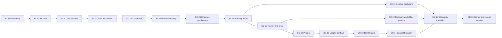

# Ledger: X-Ray Fencing Takeoff — Product Completion

Approved: yes @ 2026-09-04 (User said: "map out every single feature and plan build test - parralell agents, all working in order like caterpillar")
Baseline commit: `c3ac22cd059d522a44156b6372b1219b0d023dca`
Baseline branch: `feat/v1-production-ready`
Graph / boundary: the complete X-Ray web app, Tauri desktop shell, deterministic engine, MCP surface, packaging, and Looplet integration. External Looplet services remain outside this repository until a real contract and sandbox are supplied.

## Epic goal

Ship an evidence-first fencing takeoff product that accepts a real plan and site evidence, lets an estimator calibrate and trace editable fence runs and gates, applies explicit per-run specifications, derives a deterministic reviewed BOM, prices it from known rates, and hands an auditable draft to Looplet. The same workflow must survive restart, run in the packaged Windows application without a separately installed Python runtime, and be proven on web and desktop.

This ledger replaces checkbox-by-assertion planning. A feature is complete only when the implementation diff and its executed or visual proof are both recorded here.

## Status key

- **verified** — implemented and proven in the current environment.
- **partial** — real implementation exists, but the feature or proof is incomplete.
- **stub** — UI/plumbing exists without the claimed durable behavior.
- **dead** — code/artifact exists but is not reachable from the current product.
- **missing** — required target behavior has no implementation.
- **intentional-off** — deliberately excluded by the current product contract.

## Scope guardrails

- No fabricated quantities, rates, CRM acknowledgements, sync success, or engine confidence.
- A default is an explicit, editable assumption and must carry a `needs-human` review tier.
- Keep auth/database off until the product requires accounts, cross-device private data, or an authenticated Looplet server flow.
- Do not execute or distribute the untracked `engine/bin/xray-engine.exe` until provenance and recursion behavior are proven.
- No new npm dependencies without a slice-level reason and lockfile review.
- Work in this repository and branch; never use `git add -A` or destructive reset operations.
- Each slice owns explicit files and does not begin until dependency contracts are stable.
- UI completion requires desktop and mobile screenshots plus an interaction assertion and clean console.
- Engine/platform completion requires the actual function, CLI, test suite, package, or clean-machine flow to execute.

## Ordered caterpillar

Parallel agents work only inside the current segment. Their results converge into one reviewed contract before the caterpillar advances. UI, engine, and release lanes may run together only after their shared schema is fixed.

The frozen restored-shell integration contract is [`XRAY-WORKBENCH-CONTRACT.md`](./XRAY-WORKBENCH-CONTRACT.md). It is authoritative when an older screenshot, pane implementation, or ledger claim conflicts with the approved X-Ray workbench or evidence rules.

## Feature inventory — current product surface

| ID | Feature | State | Authoritative source | Required proof / gap |
|---|---|---:|---|---|
| UI-001 | Responsive X-Ray shell and brand system | verified-restored | `src/studio/Studio.tsx`, `src/styles.css` | Restored from the last good X-Ray shell after direct comparison with the user's reference captures; dev and production desktop/mobile smoke is clean. |
| UI-002 | Four-step Site → Trace → Takeoff → Quote navigation | superseded | retained feature modules only | The fence-first replacement drifted from the approved X-Ray workbench and is no longer the active shell. |
| UI-003 | Compact responsive X-Ray workbench | verified-restored | `Studio.tsx`, `styles.css`, `xray-ui-audit.mjs` | Laptop header remains legible; mobile hides both rails, keeps mode navigation scrollable, and has no document overflow. |
| UI-004 | Project preset selector | removed-from-product | retained compatibility state only | The hardcoded WTC/highrise/fencing/Ruffles selector was removed from the production workbench; no preset can fabricate job evidence. |
| UI-005 | Help action | removed | none | The non-functional header action was removed instead of presenting a dead control. |
| UI-006 | Plan import control | verified-web | `Studio.tsx`, `engine.ts`, `documents.ts` | Web imports validated PDF/DXF/SVG bytes; the typed Tauri bridge is unit-proven and awaits packaged-runtime proof in SC-11. |
| UI-007 | Import failure handling | verified-web | `Studio.tsx`, `store.ts` | Validation/storage failures surface as an actionable in-product alert. |
| SITE-001 | Source-plan card | verified-web | `DocumentPreview.tsx`, `Studio.tsx`, `current-flow-audit.mjs` | Imported SVG/DXF/PDF bytes and metadata render in Sheets and beneath the Measure overlay; SVG import/hash/render/reload is interaction-proven. |
| SITE-002 | Ready-to-trace status | verified-web | `domain.ts`, `store.ts`, `Studio.tsx` | Runtime original verification, hydration, document hash, calibration and review blockers drive the visible readiness state. |
| SITE-003 | Address, estimator, inspection date, notes | implemented-unintegrated | `store.ts` | Durable state remains, but the drifted fence-first form was removed from the active X-Ray shell. |
| SITE-004 | Inspection photo picker/gallery | verified-web | `PhotoEvidencePanel.tsx`, `store.ts`, `current-flow-audit.mjs` | Validated originals, captions, hashes, ordering, reciprocal run/gate links, update/removal and reload are interaction-proven. |
| SITE-005 | Start-tracing action | superseded | readiness-driven Measure pane | The old one-shot action was removed; Measure exposes tools while readiness and review gates fail closed at the quantity boundary. |
| TRACE-001 | Imported page rail and controls | verified-web | `documents.ts`, `store.ts`, `Studio.tsx` | The rail uses the active document's real page count, clamps selection, and renders the retained original. |
| TRACE-002 | Editable multi-segment fence run | verified-web | `tracing.ts`, `store.ts`, `IsoCanvas.tsx` | Explicit Enter/double-click commit, stable revisions, insert/move/remove/split/merge, selection and persisted gross/net geometry are covered. |
| TRACE-003 | Associated gate opening | verified-web | `tracing.ts`, `store.ts`, `TraceEditorPanel.tsx` | Gates project onto a selected run; type/width/association edit; overlapping deductions union and cap safely. |
| TRACE-004 | Area polygon | partial | `store.ts`, `IsoCanvas.tsx` | Math exists; unused by fencing flow. |
| TRACE-005 | Move/pan | partial | `IsoCanvas.tsx` | Code exists; current-flow interaction proof missing. |
| TRACE-006 | Zoom/reset | partial | `IsoCanvas.tsx` | Code exists; current-flow interaction proof missing. |
| TRACE-007 | Per-page trusted calibration | verified-web | `calibration.ts`, `store.ts`, `CalibrationPanel.tsx`, `IsoCanvas.tsx` | Two-point m/cm/mm/ft/in calibration, affine transform, candidate provenance/confidence/conflicts, explicit resolution and lock are persisted and interaction-proven. |
| TRACE-008 | Vector/manual visibility | stub | `IsoCanvas.tsx` | Controls procedural geometry, not imported source. |
| TRACE-009 | Vertex/markup/pending-point snapping | verified-unit | `snapping.ts`, `snapping.test.ts` | Seven unit tests pass; imported vectors not supported. |
| TRACE-010 | Snap indicator and live length | partial | `IsoCanvas.tsx` | Canvas-only and untested in current flow. |
| TRACE-011 | L/A/C/Enter/Escape and numeric shortcuts | verified-unit | `shortcuts.ts`, `shortcuts.test.ts` | Integration needs current-flow coverage. |
| TRACE-012 | M shortcut | verified | `shortcuts.ts`, `current-flow-audit.mjs` | Selects the visible Move tool on Trace; removed Sketch routing is gone. |
| TRACE-013 | S shortcut | verified | `Studio.tsx`, `shortcuts.ts`, `current-flow-audit.mjs` | One owning handler produces exactly one snap toggle per key press. |
| TRACE-014 | Run inspector | verified-web | `SpecificationPanel.tsx`, `TraceEditorPanel.tsx`, `store.ts`, `Studio.tsx` | Required run/gate fields, vertex/corner/post overrides, revisions and approval invalidation are integrated and interaction-proven. |
| TRACE-015 | Run/vertex/gate selection | verified-web | `IsoCanvas.tsx`, `Studio.tsx`, `store.ts` | Canvas hit-testing, item rows and vertex handles drive the same durable selection. |
| TRACE-016 | Per-sheet items and bounded history | verified-web | `store.ts`, `TraceEditorPanel.tsx` | Revision-safe edit/delete history is capped at 100; undo/redo repairs invalid selections. |
| TAKE-001 | Runs/net length/gates summary | verified-local | `Studio.tsx`, `tracing.ts` | Uses reconciled net run length after gate-opening deductions; downstream BOM remains SC-07. |
| TAKE-002 | Evidence register | verified-web | `Studio.tsx`, `PhotoEvidencePanel.tsx`, `current-flow-audit.mjs` | Source hash, calibration, run/gate revisions, photo originals, reciprocal links and current blockers are visible and reload-proven. |
| TAKE-003 | Review status | verified-web | `Studio.tsx`, `store.ts`, `domain.ts` | Attributed approve/reject decisions bind to entity revisions and invalidate only the mutated entity. |
| TAKE-004 | Materials warning | verified-copy | `Studio.tsx` | Honest warning; run data cannot yet resolve it. |
| TAKE-005 | Quote readiness gate | verified-web | `quoteReadiness.ts`, `store.ts`, `Studio.tsx` | The active Cost/Review/Proof panes consume runtime asset and canonical job blockers; unavailable pricing and handoff remain disabled. |
| QUOTE-001 | Unpriced run/gate draft summary | partial | `Studio.tsx` | Excludes specifications, BOM, area, site evidence, and revisions. |
| QUOTE-002 | Materials/labour placeholder | verified-honest | `Studio.tsx` | Explicitly does not invent output. |
| QUOTE-003 | Handoff checklist | stub | `Studio.tsx` | Cannot become complete from real state. |
| QUOTE-004 | Send to Looplet | missing | `Studio.tsx` | Correctly disabled. |
| QUOTE-005 | Draft JSON download | partial | `Studio.tsx`, `domain.ts` | Exports the versioned local job and blockers; BOM/pricing/handoff contracts remain. |
| DATA-001 | Versioned local job state and autosave | verified-local | `domain.ts`, `persistence.ts`, `store.ts` | Validated local reload and fail-closed recovery pass; multi-job revisions remain later scope. |
| DATA-002 | Engine result retention | partial | `documentContract.ts`, `store.ts`, `engine.ts` | Imported takeoff payload is retained with document content; BOM consumption/export remains SC-07. |
| DATA-003 | Authentication/database | intentional-off | `src/lib/auth`, `src/lib/db.ts` | Correctly dormant for a local-first current scope. |

## Feature inventory — deterministic engine and agent surface

Python 3.12.10 was installed into a temporary, isolated test directory from the checksum- and Authenticode-verified Python Software Foundation installer. The full engine suite now executes locally; feature rows remain partial where their specific behaviour lacks focused proof.

| ID | Feature | State | Authoritative source | Required proof / gap |
|---|---|---:|---|---|
| ENG-001 | Unified adapter/pack takeoff pipeline | partial | `engine.py` | Add schema/golden/integration tests. |
| ENG-002 | Missing/empty/oversize/magic/PDF preflight | partial | `preflight.py` | Boundary/security suite. |
| ENG-003 | PDF text extraction/page classification | partial | `sources/pdf.py` | No PDF geometry extraction for fencing. |
| ENG-004 | Fragmented/rotated word reassembly | partial | `reassemble.py` | Unit/golden corpus absent. |
| ENG-005 | Drawing grammar classification | partial | `grammar.py` | OCR confidence currently overstated. |
| ENG-006 | Declared/voted/manual scale resolution | partial | `scale.py` | Add conflict and calibration tests. |
| ENG-007 | Dimension chain/band/cross-sheet/trig checks | partial | `chains.py` | Test corpus absent. |
| ENG-008 | Table reconstruction | partial | `tables.py` | Golden schedule tests absent. |
| ENG-009 | Trade-pack registry/failure isolation | partial | `packs.py` | Pack isolation tests absent. |
| ENG-010 | Fencing layer/run detection | partial | `packs_fencing.py` | CAD/SVG only; PDF path cannot supply runs. |
| ENG-011 | Fence post estimation/reconciliation | partial-buggy | `packs_fencing.py` | Uses floor instead of ceil; lacks topology. |
| ENG-012 | Gate block counting | partial | `packs_fencing.py` | No widths, types, deductions, or hardware. |
| ENG-013 | Colorbond/paling/chainmesh BOM expansion | partial-disconnected | `fence_bom.py` | Not invoked by engine/MCP; Colorbond sheet logic is suspect. |
| ENG-014 | Footing/concrete/cap formulas | partial | `fence_bom.py` | Global defaults only; needs site/engineer overrides. |
| ENG-015 | Fence pricing hook | broken | `fence_bom.py` | Imports absent `pricing.costing` package. |
| ENG-016 | Electrical schedule pack | partial | `packs_electrical.py` | Fixture smoke only. |
| ENG-017 | Residential envelope pack | partial | `packs_residential.py` | Assumes rectangular/reconciled geometry. |
| ENG-018 | Structural semantic-layer pack | partial | `packs_structural.py` | Real project golden tests absent. |
| ENG-019 | Shed pack/hardening | partial | `packs_shed.py`, `quantify.py`, `hardening.py` | Real adapter coverage absent. |
| ENG-020 | Survey points/mesh/elevation pack | partial | `packs_survey.py` | Golden tests absent. |
| ENG-021 | Production DXF adapter/recursive blocks | partial | `sources/dxf.py` | TEXT/MTEXT not ingested; failures swallowed. |
| ENG-022 | Legacy DXF parser | verified-committed | `dxf.py`, `test_dxf_ifc.py` | Four committed tests; not production adapter. |
| ENG-023 | SVG adapter | partial | `sources/svg.py` | Ignores transforms/circles; curves become chords. |
| ENG-024 | IFC STEP parser/adapter | partial | `ifc.py`, `sources/ifc.py` | One parser test; units hardcoded and positions meaningless. |
| ENG-025 | OCR backend plumbing | stub | `ocr.py` | Stub is fake; Tesseract deps/runtime/tests absent. |
| ENG-026 | Marked PDF annotations | partial-buggy | `markup_writer.py` | Page mapping appears off by one; timestamps/UUIDs non-deterministic. |
| ENG-027 | HTML quote/evidence report | partial | `report.py` | Snapshot/accessibility proof absent. |
| ENG-028 | Quote-line envelope | partial | `server/quote_lines.py` | Evidence-linked and unpriced; not Looplet schema. |
| ENG-029 | Stock/allowance/cut-list conversion | verified-kernel | `orders.py`, `test_orders.py` | Exact bounded optimisation, kerf, remnant, spare, determinism and counterexample tests execute locally; UI/persistence integration remains SC-09. |
| ENG-030 | Wall assembly recipe | partial | `assemblies.py` | No committed tests. |
| ENG-031 | Input-quality advisor | partial | `advisor.py` | No committed tests. |
| ENG-032 | Building graph/BOM graph | partial | `graph.py` | No committed tests. |
| ENG-033 | Symbol-based 3D wireframe | partial-presentation | `wireframe.py` | Not building reconstruction. |
| ENG-034 | Box-solid/glTF export | partial-presentation | `solid.py` | Generic prisms; no semantic geometry proof. |
| ENG-035 | Multi-floor arithmetic rollup | partial | `rollup.py` | User-supplied replication, not floor recognition. |
| ENG-036 | Python CLI | partial | `cli.py`, `__main__.py` | Fresh execution unavailable. |
| MCP-001 | FastMCP stdio server | partial | `mcp_server.py` | Six tools registered; no isolation/auth/path policy. |
| MCP-002 | `engine_info` | verified-committed | `mcp_server.py`, `test_mcp.py` | Test not freshly executable here. |
| MCP-003 | `run_takeoff` | verified-smoke-committed | same | Only fixture smoke. |
| MCP-004 | `quote_draft` | verified-smoke-committed | same | Generic envelope; no Looplet mapping. |
| MCP-005 | `run_takeoff_calibrated` | partial | `mcp_server.py` | No validation/test. |
| MCP-006 | `marked_pdf` | partial-unsafe | `mcp_server.py` | Arbitrary output path. |
| MCP-007 | `wireframe_scene` | partial | `mcp_server.py` | Presentation geometry; untested. |
| MCP-008 | HTTP/worker API | missing | none | Requirements/comments are not implementation. |

## Feature inventory — desktop, distribution, and integration

| ID | Feature | State | Authoritative source | Required proof / gap |
|---|---|---:|---|---|
| DESK-001 | Tauri app/window | partial | `src-tauri/tauri.conf.json` | Runtime screenshot and clean build needed. |
| DESK-002 | Native PDF/DXF/SVG picker | partial-unit | `src-tauri/src/lib.rs`, `engine.ts` | Rust validates regular file, extension, size, declared kind, bounded content signatures, and exact SHA-256 before runner invocation. Full parser validation, page count, TOCTOU and packaged execution remain SC-11. |
| DESK-003 | Job-to-BOM IPC | partial-local | `src-tauri/src/lib.rs`, `engine/host`, `bomTransport.ts`, `bomStore.ts` | Typed run/status/cancel and strict request/result identity pass local unit plus development and production-bundle browser proof with deterministic fake Tauri; packaged sidecar lifecycle remains SC-11. |
| DESK-004 | BOM status/cancel IPC | partial-local | `src-tauri/src/lib.rs`, `bomTransport.ts` | Current typed surface is locally exercised; native packaged-window behavior remains unproved. |
| DESK-005 | Rust engine discovery/status | verified-host-unit | `engine/host/src/lib.rs` | 34 tests pass locally; one explicit fixture test is intentionally ignored. |
| DESK-006 | Rust spawn/timeout/output/scratch cleanup | partial | `engine/host/src/lib.rs` | No happy-path packaged-engine test. |
| DESK-007 | Tauri frontend build | broken | `tauri.conf.json`, `vite.config.spa.ts` | Points at removed legacy SPA and bypasses app-env wrapper. |
| DESK-008 | Frozen engine sidecar | stub/miswired | `build-sidecar.*`, Tauri config | Dry run checks source only; `externalBin` absent. |
| DESK-009 | Windows installer artifact | partial/high-risk | `public/X-Ray-by-Looplet-Setup.exe` | Unsigned, stale, no clean-VM proof, possibly lacks engine. |
| DESK-010 | Linux package | claim-only | CI config | No stored successful run/install proof. |
| DESK-011 | macOS package | missing | none | No CI, signing, notarization, or universal build. |
| WEB-001 | TanStack/Vercel production build | verified-local | `vite.config.ts`, routes | Build and dev/production parity smoke pass. |
| WEB-002 | PWA manifest/install tutorial/branding | verified-local | `grok-pwa-*`, `__root.tsx`, `package.json` | The explicit cross-platform npm suite includes the PWA plugin tests; web-offline behaviour is separately missing under WEB-003. |
| WEB-003 | Offline service worker/cache/update | missing | none | “Offline PWA” claim is false. |
| WEB-004 | Standalone pipeline HTML | dead-legacy | `public/xray-model-pipeline.html` | Not current product. |
| CI-001 | Web/desktop Actions matrix | partial | `.github/workflows/ci.yml` | No run links/artifact proof; many gates omitted. |
| CI-002 | Node app tests | verified-local | `npm test` | Current baseline: 195/195 script tests and 294/294 TypeScript tests pass. |
| CI-003 | Script/tooling tests | verified-local | `package.json`, script tests | Explicit cross-platform list runs 195/195 on Windows. |
| CI-004 | Rust transport tests | verified-local | `engine/host`, `src-tauri` | Host passes 34 tests plus one intentionally ignored fixture; the focused Windows security pair passes 2/2; Tauri passes 24 tests via the reviewed local Rust toolchain. |
| CI-005 | Python engine tests | verified-local | `engine/python/xray/test_*.py`, `test_job_bom.py`, `test_orders.py` | Full engine discovery: 60 passed, 1 MCP skip and 22 subtests; SC-07 kernel subset: 55 passed and 22 subtests. MCP remains unverified until its separately pinned dependencies are installed. |
| CI-006 | Browser dev/production smoke | verified-local | `browser-smoke.mjs` | Current UI passes desktop/mobile and parity. |
| CI-007 | Current feature interaction audit | verified-local | `scripts/current-flow-audit.mjs` | Proves the restored ten-pane import→calibration→trace→specification→photo→review→reload path in development and production, including mobile containment. |
| CI-008 | Lint/a11y/security/SBOM gates | missing | workflow | Add explicit gates and artifacts. |
| CI-009 | Ten-pane browser runner | verified-local | `scripts/workbench-pane-audit.mjs` | Uses Edge on Windows, navigates the exact ten-pane contract, and captures each pane without invoking side effects. |
| CRM-001 | Generic engine quote draft | partial | `server/quote_lines.py` | Not a Looplet-owned schema. |
| CRM-002 | Browser CRM bridge | disabled-truthful | `crmBridge.ts` | Produces unpriced observation lines and fails closed; no transmission or fake receipt. |
| CRM-003 | Authenticated Looplet handoff | missing | none | Needs contract, target identity, auth, idempotency, receipt. |
| SYNC-001 | Local sync queue | disabled-truthful | `sync.ts` | Enqueue fails explicitly and flush preserves records; no fake synced state. |
| SYNC-002 | Attachment pull/push/conflict recovery | missing | none | Requires API and durable queue. |
| SEC-001 | Auth scaffold | verified-dormant | `src/lib/auth` | Does not secure Looplet integration. |
| SEC-002 | Runtime/supply-chain hardening | partial | Rust host, lockfiles | CSP null, unsigned installer, unpinned server/MCP dependency ranges, unrestricted MCP paths. |
| OFF-001 | Reload-local continuity | verified-local | `persistence.ts`, `documents.ts`, `evidence.ts` | Job metadata and binary originals survive ordinary reload; this does not prove cold offline startup. |
| OFF-002 | Portable complete job archive | missing | none | Needs versioned manifest, original-byte inclusion policy, hashes, migrations and import/export recovery proof. |
| OFF-003 | Cold web offline startup/update | decision-required | no service worker | Either implement and test a versioned app-shell cache or explicitly declare web offline out of scope and remove every claim. |
| DATA-004 | Storage quota, persistence and eviction recovery | missing | none | Add quota diagnostics, persistent-storage request state, missing-original recovery and interrupted-write tests. |
| DATA-005 | Multi-job lifecycle | decision-required | one local job key | Freeze whether create/open/duplicate/archive/delete is product scope before adding shared storage. |
| AUTH-001 | Actor/org/target identity and tenancy | decision-required | dormant scaffold only | Keep auth/database off unless the Looplet-owned contract requires delegated identity or cross-device/team data. |
| COLLAB-001 | Realtime multiuser co-editing | intentional-off | unused template helper only | Parallel build agents are not a product collaboration feature; require a separate approved epic before auth/signalling/merge work. |
| INT-001 | Server-only Looplet transport | missing | fail-closed browser bridge | Requires Looplet-owned contract, auth flow, explicit target and sandbox. |
| INT-002 | Idempotent receipt and durable outbox | missing | disabled sync queue | Requires immutable snapshot digest, replay-safe key, atomic acknowledgement and restart-safe retry. |
| INT-003 | Attachment/conflict synchronisation | missing | none | Requires bounded attachments, hashes, concurrency tokens and conflict UX. |
| REL-001 | Signed release/checksum/update/rollback | missing | none | Define after packaged workflow is proven. |
| REL-002 | Unified app/engine/contract version manifest | missing | scattered versions | One release identity must bind web, Tauri, engine, schemas, rules and fixtures. |
| REL-003 | Artifact provenance, SBOM and signing | missing | none | Produce checksums, SBOM, build provenance and supported-platform signatures. |
| REL-004 | Update, rollback and migration recovery | missing | none | Test signed update, failed update, forward migration, rollback and data recovery on a clean machine. |

## Dead code and claims to remove or quarantine

| ID | Surface | State | Action |
|---|---|---:|---|
| LEG-001 | WTC/high-rise/model/render pane state | dead demo | Move to explicit lab route or remove after dependency search. |
| LEG-002 | WebGL model/faces/elevation stack | dead from current UI | Keep only if a later evidence visualization slice owns it. |
| LEG-003 | Hardcoded 48 m fencing geometry and `$3,045.08` BOM | dead unsafe demo | Delete before BOM integration. |
| LEG-004 | Simulated Render Studio/xAI progress | dead fake | Delete. |
| LEG-005 | Old CRM bridge with invented rates | dead fake | Delete after quote tests are replaced. |
| LEG-006 | Fake two-way sync queue | dead fake | Delete before real sync design. |
| LEG-007 | Old feature verifiers | stale | Replace with current-flow audits. |
| LEG-008 | Old mind map/completion ledgers | superseded | Point them here; never use them as proof. |
| LEG-009 | Duplicate legacy `index.html` / `src/main.tsx` SPA | removed | Their removal fixed blank production output. |

## Test matrix

| Layer | Required command/proof | Current result | Gate |
|---|---|---|---|
| TypeScript | `npm run typecheck` | pass | every UI/data slice |
| Node unit | `npm test` with explicit cross-platform file list | 195 script tests + 294 TypeScript tests pass | every slice |
| Rust host | `cargo test --offline --manifest-path engine/host/Cargo.toml` | 34 pass; one explicit fixture ignored | every host/packaging slice |
| Rust Tauri | `cargo test --offline --manifest-path src-tauri/Cargo.toml` | 24 pass | every desktop bridge slice |
| Python kernels | isolated Python 3.12.10, `pytest` on `test_job_bom.py` + `test_orders.py` | 55 passed + 22 subtests | SC-07C/D |
| Python engine | isolated Python 3.12.10, discovery over `engine/python/xray` + `engine/server` | 60 passed + 22 subtests; one MCP skip because server dependencies are not pinned/installed | SC-12/15 must close the skip |
| Cross-language BOM | `npm run test:bom-parity` | four fixture outputs byte-identical across TypeScript, Python and expected goldens; hashes stored in `proof/SC-07/convergence.json` | SC-07E |
| Web dev | desktop + 390×844 smoke | pass, no overflow/errors | every visual slice |
| Web production | built smoke against dev baseline | pass, no divergence | every web release slice |
| Interaction | `node scripts/current-flow-audit.mjs` | current restored ten-pane flow passes in development and production | every UI/data slice |
| Desktop | packaged app import → engine → render → restart | missing | SC-11 |
| Installer | clean Windows VM install → takeoff → uninstall | missing | SC-13 |
| Looplet | sandbox create/update with receipt/idempotent replay | missing | SC-10/13 |
| Offline/sync | disconnect, mutate, restart, reconnect, conflict | missing | only if real sync remains in scope |

## Slice plan

### SC-00 — Truth reset and complete feature map  [done]
DONE (machine): three non-overlapping source audits; app tests 79/79; Rust host 4/4; diff check clean at audit time.
DONE (human): current desktop/mobile Site UI, trace-to-Takeoff flow, and built parity inspected.
Current integrity proof: `proof/master-plan.json` is regenerated by `npm test` and verifies 139 uniquely identified feature/dead-code rows, SC-00…SC-16 ordering, all 44 queue items, the single active segment/item, linked contract hashes, and 324 future/residual acceptance rows: 279 contiguous slice rows (RP/PR/IR/DC) plus 45 residual feature gates (FC-001…FC-045). The machine-checked crosswalk is `XRAY-FEATURE-ACCEPTANCE-CROSSWALK.md`, partitioned into `planning/crosswalk-product.md`, `planning/crosswalk-engine.md`, and `planning/crosswalk-release.md`. `XRAY-CATERPILLAR-EXECUTION-MAP.md` schedules all 359 active-forward BR/RP/PR/IR/DC/FC rows exactly once across the non-overlapping parallel waves in `planning/caterpillar-sc07-sc09.md`, `planning/caterpillar-sc10-sc12.md`, and `planning/caterpillar-sc13-sc16.md`.
Files: this ledger, live TODO, branch/completion ledgers.
Depends on: —
Notes: Python unavailable. CRM, sync, offline PWA, packaging, and release claims were downgraded.
Commit: — pending human review.

### SC-01 — X-Ray workbench design recovery  [done]
DONE (machine): restored the last good cream/charcoal workbench shell; typecheck/build pass; desktop/mobile dev and production smoke clean and identical; Model keyboard navigation and canvas render pass.
DONE (human): compared directly against the user's X-Ray reference captures from `Pictures`; screenshots show the persistent ten-mode rail, project sheets, central plan/model surface, evidence sidebar, and technical typography without desktop or mobile document overflow.
Files: `Studio.tsx`, `styles.css`, `xray-ui-audit.mjs`.
Depends on: SC-00 conceptually; implementation preceded audit.
Notes: visual shell only; input, plan, inspector, review, BOM, and handoff are not complete.
Commit: — pending human review.

### SC-02 — Versioned fencing job domain and persistence  [done]
DONE (machine): typed versioned job/document/calibration/run/gate/photo/review/BOM/quote schema; fail-closed local persistence; 195 script + 88 TypeScript tests; typecheck/build; Rust host 4/4; dev/production parity smoke.
DONE (human): Site and Run values survive navigation/reload; invalid records show an actionable alert; an 8.26 m run retains system/height/ground; Quote stays gated; desktop/mobile screenshots inspected.
Files: new domain/persistence modules and tests, `store.ts`, focused forms.
Depends on: SC-01. Local-first only; no auth/database.
Notes: Hydration reads local storage only after mount; corrupt/unsupported data never overwrites the safe default. Proof: `screenshots/current-flow-*.png`, `screenshots/current-flow-audit.json`, `screenshots/sc02-dev.json`, and `screenshots/sc02-built.json`.

### SC-03 — Real imported document model and renderer  [done]
DONE (machine): validated bytes/metadata/SHA-256/page count feed the versioned job; binary content persists in IndexedDB; web/Tauri share one typed contract; real PDF fixtures count 5/24/1 pages (including compressed objects); PDF/DXF/SVG, mismatch, malformed, empty, unique-ID and 100 MB boundary tests pass; no fabricated sheets; 195 script + 101 TypeScript tests, typecheck and production build pass; Tauri 5/5 and engine-host 4/4 Rust tests pass.
DONE (human): an imported SVG survives reload, renders as the source beneath trace markup, and uses its real one-page navigation; desktop/mobile production screenshots were inspected with no overflow, console errors, page errors, or dev/build divergence.
Depends on: SC-02.
Notes: browser proof is `screenshots/current-flow-audit.json`, `screenshots/current-flow-document.png`, `screenshots/current-flow-trace.png`, and `screenshots/sc03-built-final-pdf.json`. Packaged desktop execution remains deliberately assigned to SC-11.

### SC-04 — Per-page calibration and trust model  [done]
DONE (machine): page-scoped two-point calibration converts m/cm/mm/ft/in; invertible affine document/canvas transforms round-trip; declared/inferred/manual candidates carry evidence and confidence; deterministic 0.5% conflict detection requires explicit resolution; lock/unlock and duplicate-sheet invariants pass; metric tools fail closed without the active page's lock; 195 script + 126 TypeScript tests, typecheck and production build pass.
DONE (human): the estimator enters a 5 m reference, marks two plan endpoints, sees numbered evidence, locks the selected scale, measures exactly 5.00 m, reloads with calibration/run/spec intact, and sees the responsive trust panel on desktop/mobile. Production interaction audit and smoke have zero browser errors or overflow.
Depends on: SC-03.
Notes: proof is `screenshots/current-flow-audit.json`, `screenshots/current-flow-calibration.png`, `screenshots/current-flow-mobile-calibration.png`, and `screenshots/sc04-built-final.json`. Conflict selection and lock behavior is additionally render-tested in `calibrationPanel.test.ts` and state-tested in `calibrationStore.test.ts`.

### SC-05 — Editable fence and gate tracing  [done]
DONE (machine): immutable revision-checked commands cover multi-segment creation, vertex move/insert/remove, split/merge with explicit endpoint orientation, projected gate creation/update/removal, overlap-safe deductions, topology validation, direct canvas hit-testing/dragging, bounded undo/redo and legacy migration; M/S shortcut faults are fixed; 195 script + 155 TypeScript tests, typecheck and production build pass.
DONE (human): an estimator creates a three-vertex 5.00 m run, inserts/removes a vertex, undoes/redoes, creates a gate, undoes/redoes it, changes its width to 1.20 m, reloads, and sees a reconciled 3.80 m net takeoff. Desktop/mobile editor views are inspected with clean browser output; the mobile canvas toolbar wraps inside the drawing stage with verified 8 px insets in development and production.
Depends on: SC-04.
Notes: proof is `screenshots/current-flow-audit.json`, `screenshots/current-flow-trace.png`, `screenshots/current-flow-mobile-calibration.png`, and `screenshots/sc05-built-toolbar-final2.json`. Split/merge, drag hit-testing, stale revisions and overlapping gates are additionally covered by pure/store/canvas suites.

### SC-06 — Durable evidence and run specifications  [done]
DONE (SC-06B): required entity/global revisions, attributed decisions, approval invalidation, exact gate placement, asset rehash/readiness, referential invariants, single-flight hydration, and runtime quote readiness are enforced.
DONE (SC-06C): the restored ten-pane workbench integrates real document metadata/preview, calibration, tracing, specifications, photos, canonical review blockers, runtime cost readiness and proof revisions. Fabricated production actions now fail closed.
DONE (SC-06D): the replacement ten-pane audit proves real SVG import/hash/render, calibration lock, revisioned trace edits and undo/redo, full run specification, associated gate deduction, two real photo originals with hashes/links/order, approvals, targeted invalidation, two reloads, update/removal persistence, desktop/mobile containment, and identical rebuilt-production behaviour.
Depends on: SC-05.
Notes: `screenshots/current-flow-audit.json` and `screenshots/current-flow-built-audit.json` are both `ok=true`; toolbar containment is measured at 8 px on both sides. The full-shell cream/charcoal correction is visually proved by `screenshots/design-proof-charcoal.jpg`, `screenshots/design-proof-cream.jpg`, `screenshots/design-proof-smoke.png`, and `screenshots/design-proof-smoke-mobile.png`; `screenshots/design-proof-built.json` reports no dev/build divergence. Invalid/oversized imports, conflicts, split/merge/delete and corrupt-original recovery remain lower-level-test proof. BOM/pricing/export/external actions were intentionally not invoked.

### SC-07 — Correct fencing BOM and engine bridge  [in-progress: G]
DONE (SC-07A): the strict job-to-BOM boundary is frozen with canonical hashing, exact same-sheet topology identity, fail-closed compiler checks, typed material and gate capabilities, and ten JSON fixtures covering eleven A–I cases. The accepted goldens prove 13 Colorbond sheets, 91 timber palings, chain-wire strainer roles, explicit double-gate hardware and exact staged concrete rounding to 0.23 m3.
DONE (SC-07B): the pure TypeScript rules kernel passes topology, gate-boundary, incident-strainer, allowance, assumption-lineage and aggregate-formula tests against all frozen goldens. The normal cross-platform suite now passes 195 script tests plus 294 TypeScript tests; typecheck and production build pass.
DONE (SC-07C/07D): the independent Python rules kernel and deterministic bounded order optimiser execute under an isolated verified Python 3.12.10 runtime. The focused suite passes 55 tests plus 22 subtests; full engine discovery passes 60 tests plus 22 subtests, with only the separately scoped MCP dependency suite skipped. Runtime execution exposed and fixed whole-millimetre bay distribution and gate drop-bolt line-ID parity defects.
DONE (SC-07E): `npm run test:bom-parity` executes both kernels against every frozen request and proves byte-identical TypeScript, Python and expected responses. `proof/SC-07/convergence.json` records request/response/source hashes and runtime versions. Persistence, transport and Cost integration may now proceed in order as SC-07F/G/H.
DONE (SC-07F): strict versioned BOM state and job-scoped persistence atomically retain the full validated response plus immutable source/recipe/ruleset/input bindings. Runtime store actions reject stale/out-of-order completion, invalidate on job/source change, preserve the last valid snapshot across failures, recover interrupted pending work on reload and roll back failed storage writes. Focused state/persistence/store proof passes 24 tests.
IN PROGRESS (SC-07G): the canonical TypeScript boundary and Rust host validate exact contracts/digests/bindings, share frozen size/time limits, expose typed redacted failures, bound streams/results/status, isolate and clean scratch state and use injected harmless fixtures. Tauri exposes only async BOM status/run/cancel plus separate plan import, re-hashes exact source bytes, validates bounded PDF/DXF/SVG content before invocation, uses injected runners, isolates concurrent requests and cancels tracked work on close/exit. Direct proof now covers exact stream boundaries, Tauri request/source binding, changed-file-after-import rejection before the runner, typed request-ID/timeout/null-result errors, separate import/BOM commands, blocked-input cancellation, zero-exit wrong-schema rejection, spawn/panic/shutdown cleanup, Windows Job Object descendant termination, Windows junction rejection and protected scratch DACL, Python boundary rejection, true web-host unavailability, UI responsiveness while invoke is held, safe failure rendering and late-result/newest-request precedence in development and production. The captured local Windows manifest is `proof/SC-07/transport.json`: 63/63 focused TypeScript tests, 60 Python tests with 174 subtests, 34 Rust host tests plus one intentionally ignored fixture, 2/2 focused Windows filesystem-security tests, 24/24 Tauri tests and both browser audits pass; 34 BR rows are verified, 1 remains partial, and none are open. Only BR-013 remains: the Windows path is executed, but no WSL, Docker, Podman or Unix shell exists locally to produce the required current Unix process-group artifact. CI is configured to execute and capture that artifact on Ubuntu, but no remote run or artifact is claimed. Packaged-sidecar lifecycle remains correctly owned by SC-11D/F rather than being claimed here.
DONE (SC-07H): the Cost mode follows the locked cream/charcoal drafting-workbench grammar as one flat quantity register with compact review controls, attributed recipe-assumption confirmation, durable current/stale states, domain/transport failure separation and calculation/evidence drill-down. Populated design proof is in `screenshots/bom-workbench-proof*.png`. Both `proof/SC-07/bom-flow-audit-dev.json` and `proof/SC-07/bom-flow-audit-built.json` pass at 1280×800 and 390×844: no-recipe and actor gates, four accepted assumptions, deterministic fake-Tauri generation committed atomically as 11 visible lines, calculation/evidence navigation, reload restoration, cancellation preservation and combined recipe/job staleness all pass with no console errors or overflow. The production audit records its append-only 111-byte store-observability assignment, zero replacements, and the exact original route-chunk SHA-256; it does not claim byte-identical serving or native-engine execution. Actual packaged-native parity remains explicitly owned by SC-11D/F and is not part of this web integration acceptance.
PENDING (SC-07I): after SC-07G closes, resolve FC-017 by replacing import-side-effect registration with an allow-listed, versioned and failure-isolated pack registry. Existing SC-07B/E proof may be referenced only where its exact artifacts cover the row; any uncovered behaviour needs a new diff and executed/human proof. FC-015 and FC-019…FC-022 no longer sit ahead of their prerequisites: they close in SC-08A2…A6 after source, calibration and proposal/review foundations exist.
Depends on: SC-06.

### SC-08 — Review, approvals, revisions, and proof pack  [pending]

Detailed proof contract: `SC08-REVIEW-PROOF-ACCEPTANCE.md` (RP-001…RP-036). Execution remains gated on SC-07G; planning this matrix does not mark any SC-08 row complete.

- **SC-08A contract:** freeze strict versioned review-record, revision-diff, proof-manifest, file-entry and export-result/error schemas. Bind decisions to entity/job revisions, source SHA-256, BOM input/output digests and recipe/ruleset versions. Machine proof: round-trip, unknown-field, stale-binding, canonical-byte and digest goldens. Human proof: field-by-field inspector review.
- **SC-08A2…A6 dependent engine closure:** after source/calibration/proposal prerequisites, close FC-015 advisory dimensions, FC-019 post topology, FC-020 gates, FC-021 canonical material recipes and FC-022 attributed footing stages in strict order, with cross-runtime goldens and visible formula/evidence inspection at every barrier.
- **SC-08B workflow:** immutable approve/reject history; rejection reason required; BOM issues and every `needs-human` assumption become canonical blockers; transactional bulk approval refuses hidden blockers. Machine proof: stale/concurrent decision, targeted invalidation, regeneration invalidation, no-partial-commit and reload tests. Human proof: blocker → exact entity → repair → regenerate → reapprove.
- **SC-08C revision diff:** deterministic before/after values for geometry, specifications, evidence links, BOM bindings and decisions. Machine proof: add/update/delete/reorder/link/unlink fixtures and bounded history. Human proof: readable desktop/mobile run, gate, photo and BOM-line comparisons.
- **SC-08D proof pack:** canonical manifest/archive, checksums, formulas, assumptions, decisions, diffs and explicit included/omitted originals; manifest-only and originals-included modes; missing/corrupt requested bytes fail closed. Machine proof: deterministic rerun, changed-byte, traversal, duplicate-name, size-limit and interrupted-export tests. Human proof: independently open the pack and recheck hashes.
- **SC-08E marked sources:** exact zero-based workbench to one-based PDF page mapping; deterministic annotations; SVG/DXF receive standalone evidence overlays rather than a fake PDF claim. Machine proof: first/last/rotated/cropped/out-of-range page and rerun tests. Human proof: visual source-to-annotation comparison.
- **SC-08F UI/proof:** formula/assumption/evidence drill-down, diff, export selection, progress/error/retry, independent snapping/shortcut foundations and explicit “not priced/not sent” boundary. Machine proof: full web gates plus dev/built interaction audits. Human proof: 1280×800 and 390×844 captures for success, staleness, corrupt-original failure and reload. Page-rail-dependent FC-003, FC-004, FC-007 and FC-009/010 interactions wait for ordered SC-11D4…D7 waves after FC-001.

Depends on: SC-08A is dependency-safe after SC-07E, but the ordered caterpillar does not advance into SC-08 until SC-07G closes. SC-08B/F requires SC-07F/H; SC-08D/E requires A/B.

### SC-09 — Pricing and quote composition  [pending]

Detailed proof contract: `SC09-PRICING-ACCEPTANCE.md` (PR-001…PR-045). It fixes the ordered contract, catalog import/mapping, exact pricing, override/staleness and Cost/export proof rows; all remain planning-only behind the SC-08 reviewed-snapshot gate.

- **SC-09A contracts:** supplier/catalog revision and digest, effective dates, currency, tax mode, SKU/unit/pack/minimum order and immutable quote snapshot bound to reviewed BOM/catalog/rules digests. Money uses exact decimals/minor units; commercial fields never enter the SC-07 quantity contract. Tests cover canonical hash, duplicate/invalid SKU, unit, currency, date, decimal and migration failures.
- **SC-09B catalog import/mapping:** explicitly supported CSV/JSON, preview-before-commit, formula-injection/encoding/oversize rejection, deterministic SKU/unit/pack matching, ambiguous manual mapping, expired/unmatched blockers and atomic rollback. Human proof imports one valid catalog and resolves one ambiguity while one unknown stays blocked.
- **SC-09C pricing engine:** purchase packs, wastage/minimums, labour, delivery, demolition, plant, discounts if approved, tax, markup-versus-margin and final rounding in a frozen operation order. Independent table tests cover inclusive/exclusive tax, zero/negative rejection, pack minimums, overflow and reconciliation.
- **SC-09D overrides/staleness:** actor, reason, time and before/after value required; catalog/BOM/rules changes retain but mark the prior quote stale. Tests cover stale revision, audit history, targeted/full invalidation, rollback and reload.
- **SC-09E Cost UI/export:** measured versus purchase quantity, SKU/source/effective date, rates, extensions, subtotals, adjustments, tax and total with evidence drill-down. Unknown prices remain visible blockers. Browser proof covers import → mapping → override → exact total → reload on desktop/mobile and production.

Depends on: immutable reviewed BOM/proof snapshot from SC-08, not merely an editable BOM.

### SC-10 — Looplet-owned external contract intake  [externally blocked]

Detailed integration/release contract: `SC10-SC13-SC16-INTEGRATION-RELEASE-ACCEPTANCE.md` (IR-001…IR-112 across SC-10 and SC-13…16). SC-10 owns IR-001…IR-018; these rows require owner-supplied Looplet contracts and sandbox evidence and are not implementation claims.

- Obtain and provenance-record Looplet-owned versioned identity, target-search/select, quote create/update, attachment and receipt schemas plus sandbox access.
- Freeze auth mechanism/scopes, tenancy, target IDs, rate limits, payload/attachment limits, idempotency, concurrency and retry semantics before transport code.
- Contract tests reject unknown outbound fields and preserve exact fixture bytes. No browser navigation/localStorage simulation counts as handoff.

Depends on: external Looplet contract/sandbox. Transport is SC-14 after identity and recovery decisions.

### SC-11 — Current Tauri build and self-contained engine  [pending]

Detailed desktop/continuity contract: `SC11-SC12-DESKTOP-CONTINUITY-ACCEPTANCE.md` (DC-001…DC-086 across SC-11/12). SC-11 owns DC-001…DC-046; all remain planning-only, and no existing executable, sidecar or installer is accepted or executed by this plan.

- **SC-11A frontend build:** Tauri uses the current app-env-aware supported build, fails if the current artifact is missing, and cannot fall back to legacy HTML. Test current asset hashes in debug/release.
- **SC-11B sidecar:** reproducible pinned per-target build from reviewed Python source; target-triple name, checksum and provenance manifest; required `externalBin`; missing/wrong target/checksum fails packaging; no production PATH-Python fallback. Never execute the existing unknown unsigned binaries.
- **SC-11C packaged transport:** re-run and extend the verified SC-07 typed transport against the reviewed packaged sidecar; prove target name, `externalBin`, checksum/provenance binding, packaged async IPC, bounds, timeout, cancellation, process-tree termination, safe diagnostics, private scratch and cleanup. Do not duplicate the SC-07 implementation, and keep import and BOM as separate commands.
- **SC-11D lifecycle:** actual packaged import, BOM commit, review, cancellation, concurrent invocation, crash recovery, restart and storage migration; failed engine retains last valid BOM. After FC-001 establishes the real imported-page rail, SC-11D4…D7 close dependent pan, zoom, snap-overlay and final-shell shortcut rows FC-003, FC-004, FC-007 and FC-009/010 in dependency order.
- **SC-11E installer:** decide online versus fixed WebView2 prerequisite; verify metadata/version/icons/uninstall and package contents. Clean no-Python Windows proof covers install → launch → real import → calibrate/trace/specify → BOM → review → restart → uninstall, with process evidence showing no Python dependency.
- **SC-11F packaged parity:** after SC-09, repeat Review/Proof/Cost in the native window; web screenshots cannot substitute.

Depends on: SC-07G for transport; local engine package does not wait for Looplet.

### SC-12 — Local-first continuity, offline posture, and recovery  [pending]

Detailed desktop/continuity contract: `SC11-SC12-DESKTOP-CONTINUITY-ACCEPTANCE.md` (DC-001…DC-086 across SC-11/12). SC-12 owns DC-047…DC-086, including the explicit decision between intentionally unsupported web cold-offline and an approved service-worker branch.

- Freeze an ADR separating reload persistence, packaged no-network operation and optional web cold-offline support.
- Add a complete versioned job archive with plan/photo/BOM bytes, hashes, inclusion policy, migrations and fail-closed import/export; test interrupted writes, corrupt/missing originals, quota/eviction, upgrade and recovery.
- If web offline is approved, add versioned app-shell service worker/cache cleanup with no evidence bytes in CacheStorage and cold-start/update tests. Otherwise mark it intentional-off and remove every offline claim.
- Human proof: real plan/photos and derived state survive network-denied restart or show actionable recovery; export/delete/import round-trip on desktop/mobile.

Depends on: stable SC-07/08 schemas; packaged no-network proof also depends on SC-11.

### SC-13 — Identity, ownership, tenancy, and durable-data gate  [decision-gated]

Detailed integration/release contract: `SC10-SC13-SC16-INTEGRATION-RELEASE-ACCEPTANCE.md` (IR-001…IR-112). SC-13 owns IR-019…IR-034; auth and database persistence remain OFF until those decisions are explicitly approved.

- Freeze actor/org/job ownership and credential-flow threat model. Keep auth/database off if accounts, cross-device storage and delegated Looplet identity are not required.
- If the external contract requires delegated identity, enable only the necessary auth path with server-verified user/org scope, CSRF/session controls, tenant-scoped persistence and cross-tenant denial tests. Never trust a client-sent identity.
- Human proof covers signed-out/expired state, org/target switch, forbidden cross-org access and local-work recovery.

Depends on: SC-10 contract discovery and SC-12 recovery. Must close before transport.

### SC-14 — Looplet transport, outbox, attachments, and receipts  [pending]

Detailed integration/release contract: `SC10-SC13-SC16-INTEGRATION-RELEASE-ACCEPTANCE.md` (IR-001…IR-112). SC-14 owns IR-035…IR-060; no navigation, localStorage staging or mock acknowledgement counts as handoff.

- Server-only authenticated target selection and immutable dry-run payload bound to quote/proof/target/contract digests.
- Deterministic idempotency key, optimistic concurrency, typed timeout/401/403/409/422/429/5xx/ambiguous-ack errors, durable pending/failed/acknowledged outbox, restart-safe retry and atomic validated receipt.
- Bound attachment hash/type/size and partial-failure recovery; browser never stores credentials or fabricates success. Realtime multiuser editing remains intentionally off unless separately approved.
- Machine proof uses owned fixtures plus controlled sandbox/mock server. Human proof: explicit target → dry run → send → receipt → replay without duplicate, plus disconnect/edit/restart/reconnect and actionable failures.

Depends on: SC-09, SC-10, SC-12 and SC-13 plus external sandbox.

### SC-15 — Continuous CI, security, and release-candidate attestation  [pending]

Detailed integration/release contract: `SC10-SC13-SC16-INTEGRATION-RELEASE-ACCEPTANCE.md` (IR-001…IR-112). SC-15 owns IR-061…IR-088; local workflow syntax is not remote-run or artifact proof.

- Start foundational gates immediately: explicit script/TypeScript, full Python engine+MCP, both Rust crates fmt/clippy/test, lint, typecheck/build, dev+built browser/interaction/offline audits and real sidecar/package smoke; decide macOS support explicitly.
- Add least-privilege workflow permissions, SHA-pinned actions, concurrency/timeouts/retention, dependency/secret/license scans, SBOM/provenance and proof-artifact upload.
- Remove the fail-open legacy `dist/index.html` fallback and quarantine stale public mindmaps, fake sync/CRM claims and unsigned old installers. Bind every proof manifest to source/diff and lockfile hashes.
- Human proof attaches successful run URLs/artifacts and inspects CSP/network/font behaviour plus the cream/charcoal web/native UI.

Depends on: foundation begins now; closure requires SC-12–14 and prior product slices.

### SC-16 — Signed end-to-end release, update, rollback, and recovery  [pending]

Detailed integration/release contract: `SC10-SC13-SC16-INTEGRATION-RELEASE-ACCEPTANCE.md` (IR-001…IR-112). SC-16 owns IR-089…IR-112; signing, clean-machine, update, rollback, recovery and uninstall evidence remain required before release.

- One version manifest binds web, Tauri, engine, contracts, rules and fixtures; signed supported-platform artifacts include checksums, SBOM, provenance and release notes.
- Signed update channel, verification, rollback and forward/backward data-migration recovery are automated and fail closed.
- Clean no-Python VM proof records install → current UI → real plan/photo → calibration → trace/specification → BOM → review/proof → pricing → Looplet sandbox receipt when enabled → offline restart → signed update → rollback/recovery → uninstall.

Depends on: SC-15 and explicitly SC-08/09/11/12/14; external signing credentials, clean VM and Looplet sandbox.

## Immediate execution queue

1. [x] SC-02A: freeze domain types and validation invariants — 4/4 tests pass.
2. [x] SC-02B: add fail-closed local persistence and store actions.
3. [x] SC-02C: replace uncontrolled Site/Run inputs with controlled domain state.
4. [x] SC-02D: add unit, reload, desktop, mobile, and production parity proof.
5. [x] SC-03A: freeze the imported-document contract shared by web, store, preview and Tauri.
6. [x] SC-03B: validate/hash/count and persist real PDF/DXF/SVG bytes with fixture coverage.
7. [x] SC-03C: render imported content with a separate tracing overlay and actual page controls.
8. [x] SC-03D: prove import/reload/trace on desktop/mobile and the production build.
9. [x] SC-04A: freeze page, unit, transform, provenance, confidence, conflict and lock invariants.
10. [x] SC-04B: wire page-isolated calibration state and fail-closed measurements.
11. [x] SC-04C: ship the accessible trust/candidate/conflict/lock panel.
12. [x] SC-04D: prove canvas capture, exact measurement, persistence, mobile and production behavior.
13. [x] SC-05A: freeze editable trace, topology, gate deduction and command contracts.
14. [x] SC-05B: integrate revision-safe store commands and bounded undo/redo.
15. [x] SC-05C: render/select/drag durable multi-segment runs and associated gates.
16. [x] SC-05D: ship editor controls and prove create/edit/delete/undo/reload behavior.
17. [x] SC-06A: freeze durable photo evidence, run/gate specification and revision contracts.
18. [x] SC-06B: harden revision, review, asset-integrity, hydration and quote-readiness contracts.
19. [x] SC-06C: integrate documents, calibration, tracing, specifications, photos and blockers into the ten-pane X-Ray workbench; quarantine every fabricated production action.
20. [x] SC-06D: prove required fields, linking, reorder/removal, revisions and reload in development and production.
21. [x] SC-07A: freeze the versioned job-to-BOM contract, formulas, assumption tiers and TypeScript/Python parity fixtures.
22. [x] SC-07B: implement the pure TypeScript fencing rules kernel against the frozen A–I topology/material/gate/footing goldens.
23. [x] SC-07C: independent Python fencing rules execute against the identical JSON contract and goldens.
24. [x] SC-07D: deterministic bounded order kernel passes optimality, kerf, remnant, spare and offcut tests.
25. [x] SC-07E: cross-language verifier proves byte-identical TypeScript/Python/expected outputs and records source/fixture hashes.
26. [x] SC-07F: durable job-scoped BOM state, atomic commit, stale rejection, invalidation, failure retention and reload persistence are implemented and store-integrated.
27. [>] SC-07G: local TypeScript, Python, Rust host, Tauri and dev/built browser transport gates pass with a 34-verified/1-partial/0-open manifest; only BR-013's current executed Unix process-group artifact remains.
28. [x] SC-07H: the locked Cost register and full fake-Tauri generate/cancel/stale/reload path pass in development and the production bundle on desktop/mobile; packaged-native parity is retained under SC-11D/F.
29. [ ] SC-07I: close FC-017 approved pack-registry ownership after SC-07G.
30. [ ] SC-08A/A2–A6/B: freeze review/proof and source foundations, then close dependent FC-015 and FC-019…FC-022 engine rows in order before immutable decisions and stale-safe blockers.
31. [ ] SC-08C/D/E: deterministic revision diff, proof archive and marked-source adapters.
32. [ ] SC-08F: Review/Proof UI with desktop/mobile development and production evidence.
33. [ ] SC-09A/B: freeze commercial contracts and implement atomic local catalog import/mapping.
34. [ ] SC-09C/D: deterministic price engine, attributed overrides and quote invalidation.
35. [ ] SC-09E: Cost composer and exact quote export/browser reconciliation proof.
36. [!] SC-10: receive Looplet-owned schemas, auth/tenant semantics and sandbox; no transport simulation substitutes.
37. [ ] SC-11A/B: repair the current frontend build contract and produce a required reproducible sidecar.
38. [ ] SC-11C/D: extend the SC-07 bridge proof to the reviewed packaged sidecar and prove engine lifecycle/recovery.
39. [ ] SC-11E/F: clean no-Python Windows install and packaged Review/Proof/Cost parity.
40. [ ] SC-12: freeze offline posture and implement complete archive/quota/recovery behaviour.
41. [ ] SC-13: close the auth-off versus delegated identity/tenancy decision gate.
42. [ ] SC-14: implement server-only Looplet transport, outbox, attachments, conflicts and validated receipts.
43. [ ] SC-15: continuous full-stack CI/security/SBOM/provenance and dead-claim closeout.
44. [ ] SC-16: signed clean-machine release, update, rollback, recovery and uninstall proof.

## Known blockers that do not stop current work

- MCP/server dependencies use unpinned ranges and were deliberately not installed; the full engine suite passes, while four MCP tests remain skipped until those dependencies are frozen in SC-15.
- A real Looplet API/schema/sandbox is absent; SC-10 cannot complete without it.
- Signing credentials and a clean VM are absent; SC-16 remains open until supplied.
- `public/og.jpg` and `src/lib/og/site.json` exist. Windows smoke emits a false game-card warning because its detector assumes `/workspace` and treats any canvas as a game; do not mislabel this utility `x:game`.
