# X-Ray by Looplet — Top-Down Architecture Mind Map & Live TODO

This document is the product, system, and engineering mental model for **X-Ray by Looplet** (an evidence-first construction takeoff studio and desktop CAD/BOM extractor). It maps the entire application top-down across all 6 core zones and serves as our active pair-programming TODO list.

---

## 1. Top-Down Architecture Mind Map

```mermaid
flowchart TD
    Root["X-Ray by Looplet<br/>Evidence-first construction takeoff & BOM studio"]

    %% Zone 1: Web Studio UI
    Root --> Z1["Zone 1: Web Studio UI<br/>(React 19, TanStack, Tailwind v4)"]
    Z1 --> Z1_OV["Overview Pane (XR-UI-OV)<br/>Evidence stats, qualified plan status, 3D stage preview"]
    Z1 --> Z1_SH["Sheets Pane (XR-UI-SH)<br/>24 architectural sheets, 2D plan/elevation canvas"]
    Z1 --> Z1_MS["Measure Pane (XR-UI-MS)<br/>Scale calibration, length polyline, area polygon, count markers"]
    Z1 --> Z1_SK["Sketch Pane (XR-UI-SK)<br/>Manual trace polylines, commit/cancel, elevation raising"]
    Z1 --> Z1_CP["Components Pane (XR-UI-CP)<br/>Open-ended custom trade builder, assemblies"]
    Z1 --> Z1_MD["Model Pane (XR-UI-MD)<br/>3D wireframe stage, presentation height extrusion, camera modes"]
    Z1 --> Z1_RV["Review Pane (XR-UI-RV)<br/>Flag inspection: missing scale, missing plan, zero areas/trades"]
    Z1 --> Z1_CS["Cost / BOM Pane (XR-UI-CS)<br/>Evidence BOM: measured m, m², counts; zero AI hallucination"]
    Z1 --> Z1_PF["Proof Pane (XR-UI-PF)<br/>Evidence pack JSON export: plan, sheet, scale, markups, trades"]
    Z1 --> Z1_HD["Header & Global Chrome (XR-UI-HD)<br/>Pane navigation, charcoal/paper skins, install helper, download HTML"]
    Z1 --> Z1_RR["Right Rail Inspector (XR-UI-RR)<br/>Model readiness tracker, source validation, trade summary"]

    %% Zone 2: 3D Graphics & Canvas
    Root --> Z2["Zone 2: 3D Graphics & Canvas<br/>(WebGL, IsoCanvas, Geometry)"]
    Z2 --> Z2_GL["wireframeGl.ts (XR-3D-GL)<br/>GL shaders, matrix math, 3D line drawing, extrusion buffers"]
    Z2 --> Z2_ISO["IsoCanvas.tsx (XR-3D-ISO)<br/>Isometric / plan canvas, mouse rotate/pan/zoom, markup overlay"]
    Z2 --> Z2_GEO["geometry.ts (XR-3D-GEO)<br/>24 sheet definitions, building mesh B, roof prism R"]
    Z2 --> Z2_ST["store.ts (XR-3D-ST)<br/>Zustand state store, camera, pose, height, markups, trades"]

    %% Zone 3: Tauri Desktop Shell & Rust Host
    Root --> Z3["Zone 3: Tauri Desktop Shell & Rust Host<br/>(Tauri 2, Rust, Sidecar Spawner)"]
    Z3 --> Z3_CMD["src-tauri/src/lib.rs (XR-TR-CMD)<br/>Commands: xray_pick_plan, xray_run_takeoff, xray_engine_status"]
    Z3 --> Z3_CFG["tauri.conf.json (XR-TR-CFG)<br/>Window setup, plugins (dialog), bundle permissions"]
    Z3 --> Z3_HST["engine/host (XR-TR-HST)<br/>xray_engine_host crate: resolution order (env -> bin -> python3)"]
    Z3 --> Z3_SPW["Process Spawner (XR-TR-SPW)<br/>Temp scratch dir, 120s timeout, stdout/err capture, takeoff JSON extraction"]
    Z3 --> Z3_TST["Host Tests (XR-TR-TST)<br/>Cargo test suite verifying python package, missing file errors, exe names"]

    %% Zone 4: Takeoff Engine
    Root --> Z4["Zone 4: Takeoff Engine<br/>(Python 3 deterministic takeoff)"]
    Z4 --> Z4_COR["engine.py & cli.py (XR-ENG-COR)<br/>CLI entry, runner pipeline, preflight validation"]
    Z4 --> Z4_VEC["wireframe.py & solid.py (XR-ENG-VEC)<br/>Vector paths, chains, graph representation, 3D extrusions"]
    Z4 --> Z4_OCR["ocr.py & grammar.py (XR-ENG-OCR)<br/>Text recognition, scale bar detection, title block extraction"]
    Z4 --> Z4_PCK["Trade Packs (XR-ENG-PCK)<br/>Fencing, residential, structural, electrical, shed, survey"]
    Z4 --> Z4_BOM["quantify.py & rollup.py (XR-ENG-BOM)<br/>Bill of materials assembly, fence BOM, deterministic counts"]
    Z4 --> Z4_OUT["markup_writer.py & report.py (XR-ENG-OUT)<br/>Annotated PDF generation, evidence report, advice engine"]

    %% Zone 5: FastMCP Server
    Root --> Z5["Zone 5: FastMCP Agent Server<br/>(FastMCP stdio AI tool surface)"]
    Z5 --> Z5_SRV["mcp_server.py (XR-MCP-SRV)<br/>FastMCP server daemon, stdio protocol for Claude/Codex/Grok"]
    Z5 --> Z5_TLS["MCP Tools (XR-MCP-TLS)<br/>engine_info, run_takeoff, run_takeoff_calibrated, marked_pdf, wireframe_scene"]
    Z5 --> Z5_QTE["quote_lines.py (XR-MCP-QTE)<br/>Takeoff BOM -> unpriced Looplet quote line items"]
    Z5 --> Z5_TST["test_mcp.py (XR-MCP-TST)<br/>Pytest suite verifying FastMCP schema and tool execution"]

    %% Zone 6: Looplet CRM Bridge & Release
    Root --> Z6["Zone 6: Looplet CRM Bridge & Release<br/>(Ecosystem integration, PWA, packaging)"]
    Z6 --> Z6_CRM["Quote Lines Handoff (XR-INT-CRM)<br/>Takeoff JSON ingested into Looplet CRM Quote Composer"]
    Z6 --> Z6_PWA["Offline PWA / Standalone (XR-INT-PWA)<br/>Self-contained HTML build, service worker, browser persistence"]
    Z6 --> Z6_DST["Desktop Installers (XR-INT-DST)<br/>Windows MSI/WebView2, Linux deb/AppImage, macOS universal"]
```

---

## 2. Interactive Mind Map Tool

An interactive, live-editable visual representation of this top-down mind map is available at:
- **Standalone HTML**: [`xray-mindmap-topdown.html`](file:///c:/Users/danie/repo/xray-by-looplet/xray-mindmap-topdown.html)
- **Dev Server / Studio**: Open [`http://0.0.0.0:8080/mindmap-topdown.html`](http://0.0.0.0:8080/mindmap-topdown.html) while running `npm run dev`.

---

## 3. Detailed TODO Checklist Matrix

Legend:
- `[x]` **Completed & Verified**
- `[-]` **In Progress**
- `[ ]` **Backlog / Planned**

### Zone 1: Studio UI Panes (`src/studio/`)
- [x] **XR-UI-OV-01**: Overview pane with qualified plan status and evidence counters (`Studio.tsx`)
- [x] **XR-UI-OV-02**: Mini 3D interactive stage embed in overview (`Stage` component in `Studio.tsx`)
- [x] **XR-UI-SH-01**: 24-sheet navigation sidebar with sheet index and titles (`SHEETS` in `geometry.ts`)
- [x] **XR-UI-SH-02**: 2D plan and elevation projection mode per sheet type (`PlanCanvas` vs `IsoCanvas`)
- [x] **XR-UI-MS-01**: Scale calibration input (`scaleM` meters per drawing unit)
- [x] **XR-UI-MS-02**: Length polyline measurement tool with 2-click segment tracking
- [x] **XR-UI-MS-03**: Area polygon measurement tool with "Close area" commit
- [x] **XR-UI-MS-04**: Count item marker tool with discrete click point placement
- [x] **XR-UI-MS-05**: Live markup list display with delete action and sheet tracking
- [x] **XR-UI-SK-01**: Manual sketch trace layer for native plan polylines
- [x] **XR-UI-SK-02**: Commit trace and cancel pending polyline controls
- [x] **XR-UI-CP-01**: Open-ended trade & assembly builder form (no default trade assumptions)
- [x] **XR-UI-CP-02**: Dynamic trade registry list with custom notes and deletion
- [x] **XR-UI-MD-01**: 3D wireframe stage with building mesh and roof prism
- [x] **XR-UI-MD-02**: Presentation height extrusion slider for raising manual traces
- [x] **XR-UI-MD-03**: Stand 3D vs Lay Flat pose toggle with camera presets (Plan / Isometric)
- [x] **XR-UI-MD-04**: Layer visibility toggles (Source vectors, Building, Roof, Manual layer)
- [x] **XR-UI-MD-05**: Canvas screenshot capture (`Save still` PNG export)
- [x] **XR-UI-RV-01**: Deterministic flag audit engine (unattached plan, uncalibrated scale, 0 areas, 0 trades)
- [x] **XR-UI-CS-01**: Bill of Quantities (BOM) calculation strictly derived from measured markups
- [x] **XR-UI-CS-02**: Trade breakdown cards without fabricated/hallucinated quantities
- [x] **XR-UI-PF-01**: Evidence pack JSON export (`xray-evidence.json`) containing raw markups and metadata
- [x] **XR-UI-HD-01**: Charcoal navy vs paper skin switcher
- [x] **XR-UI-HD-02**: Grok vs local desktop install guidance modal
- [x] **XR-UI-HD-03**: Static standalone HTML pipeline downloader (`xray-model-pipeline.html`)
- [x] **XR-UI-ENH-01**: Multi-page PDF viewer with native zoom, pan, and vector layer toggle
- [x] **XR-UI-ENH-02**: Snapping engine for measurement tools to align with PDF vector vertices
- [x] **XR-UI-ENH-03**: Keyboard shortcuts for tool switching (`L` for Length, `A` for Area, `C` for Count, `Esc` to cancel)

### Zone 2: 3D Graphics & Canvas Engine (`src/studio/`)
- [x] **XR-3D-GL-01**: WebGL wireframe shader initialization and line rendering (`wireframeGl.ts`)
- [x] **XR-3D-GL-02**: 3D matrix transformations, projection, model-view calculation
- [x] **XR-3D-GL-03**: Dynamic line vertex buffer allocation and batch redraw
- [x] **XR-3D-ISO-01**: Isometric and orthographic camera projections (`IsoCanvas.tsx`)
- [x] **XR-3D-ISO-02**: Interactive mouse drag rotation (azimuth and elevation)
- [x] **XR-3D-ISO-03**: Mouse wheel zooming with bounds clamping
- [x] **XR-3D-ISO-04**: 2D Plan canvas rendering with interactive click coordinates (`PlanCanvas`)
- [x] **XR-3D-GEO-01**: Demo architectural house model with separate building and roof lines (`geometry.ts`)
- [x] **XR-3D-GEO-02**: 24-sheet catalog metadata with plan and elevation categorization
- [x] **XR-3D-ST-01**: Zustand state management store for studio UI, markups, camera, and trades (`store.ts`)
- [x] **XR-3D-ENH-01**: GPU-accelerated polyline thickening with antialiased screen-space shaders
- [x] **XR-3D-ENH-02**: Shaded solid surface preview option alongside wireframe lines
- [x] **XR-3D-ENH-03**: Multi-storey elevation floor stacking

### Zone 3: Tauri Desktop Shell & Rust Host (`src-tauri/` & `engine/host/`)
- [x] **XR-TR-CMD-01**: `xray_pick_plan` native file picker command with PDF, DXF, SVG filters (`src-tauri/src/lib.rs`)
- [x] **XR-TR-CMD-02**: `xray_run_takeoff` command invoking host spawner and returning parsed JSON
- [x] **XR-TR-CMD-03**: `xray_engine_status` command checking sidecar and python environment
- [x] **XR-TR-CFG-01**: Tauri 2 application manifest and dialog plugin setup (`tauri.conf.json`, `Cargo.toml`)
- [x] **XR-TR-HST-01**: Crate `xray_engine_host` library implementation (`engine/host/src/lib.rs`)
- [x] **XR-TR-HST-02**: Engine resolution hierarchy (`XRAY_ENGINE_PATH` -> `engine/bin` -> `python3 -m xray`)
- [x] **XR-TR-SPW-01**: Isolated temporary scratch directory generation and cleanup
- [x] **XR-TR-SPW-02**: Subprocess execution with 120-second timeout guard and thread-safe output capture
- [x] **XR-TR-TST-01**: Host unit test suite verifying python package presence, missing file handling, and exe naming
- [x] **XR-TR-BLD-01**: Compile frozen `xray-engine.exe` / `xray-engine` via PyInstaller for zero-dependency distribution
- [x] **XR-TR-PKG-01**: Configure Tauri Windows NSIS installer and WebView2 bundling

### Zone 4: Vector Takeoff Engine (`engine/python/xray/`)
- [x] **XR-ENG-COR-01**: Main engine orchestration and CLI entry (`cli.py`, `engine.py`, `__main__.py`)
- [x] **XR-ENG-COR-02**: Preflight PDF validation and metadata checks (`preflight.py`)
- [x] **XR-ENG-VEC-01**: Native vector path segmentation and chain extraction (`chains.py`, `graph.py`)
- [x] **XR-ENG-VEC-02**: 3D wireframe and solid mesh generation (`wireframe.py`, `solid.py`)
- [x] **XR-ENG-VEC-03**: Scale detection and unit normalization (`scale.py`)
- [x] **XR-ENG-OCR-01**: Optical character recognition integration for drawing labels (`ocr.py`)
- [x] **XR-ENG-OCR-02**: Drawing grammar rules and classification (`grammar.py`)
- [x] **XR-ENG-PCK-01**: Fencing trade pack with Colorbond/timber specifications (`packs_fencing.py`, `fence_bom.py`)
- [x] **XR-ENG-PCK-02**: Residential trade pack for framing, cladding, and plasterboard (`packs_residential.py`)
- [x] **XR-ENG-PCK-03**: Structural trade pack for concrete footings and steel (`packs_structural.py`)
- [x] **XR-ENG-PCK-04**: Electrical trade pack for outlets and switchboards (`packs_electrical.py`)
- [x] **XR-ENG-PCK-05**: Shed and portal frame pack (`packs_shed.py`)
- [x] **XR-ENG-PCK-06**: Survey pack for boundaries and setbacks (`packs_survey.py`)
- [x] **XR-ENG-BOM-01**: Quantitative rollup engine and table generation (`quantify.py`, `rollup.py`, `tables.py`)
- [x] **XR-ENG-BOM-02**: Assembly BOM expansion with exact part breakdown (`assemblies.py`)
- [x] **XR-ENG-OUT-01**: Annotated vector PDF generation with takeoff callout stamps (`markup_writer.py`)
- [x] **XR-ENG-OUT-02**: Formatted takeoff report and advisor feedback (`report.py`, `advisor.py`)
- [x] **XR-ENG-DXF-01**: Direct DXF/DWG vector parser module alongside PDF raster/vector extraction
- [x] **XR-ENG-IFC-01**: Direct IFC (Industry Foundation Classes) BIM model parser

### Zone 5: FastMCP Agent Server (`engine/server/`)
- [x] **XR-MCP-SRV-01**: FastMCP stdio server setup with `FastMCP("xray-engine")` (`mcp_server.py`)
- [x] **XR-MCP-TLS-01**: `engine_info` tool returning engine version and status
- [x] **XR-MCP-TLS-02**: `run_takeoff` tool executing deterministic takeoff on plan PDF
- [x] **XR-MCP-TLS-03**: `run_takeoff_calibrated` tool executing takeoff with user-measured scale
- [x] **XR-MCP-TLS-04**: `quote_draft` tool converting takeoff quantities to Looplet quote line format (`quote_lines.py`)
- [x] **XR-MCP-TLS-05**: `marked_pdf` tool outputting path to visual annotated PDF
- [x] **XR-MCP-TLS-06**: `wireframe_scene` tool returning 3D wireframe coordinates
- [x] **XR-MCP-TST-01**: MCP pytest suite verifying tool schema contracts (`test_mcp.py`)
- [x] **XR-MCP-REG-01**: Register X-Ray MCP server in `.cursor/mcp.json` / Claude Desktop / Grok settings for automated agent use

### Zone 6: Looplet CRM Bridge & Distribution
- [x] **XR-INT-CRM-01**: BOM to Looplet Quote Line Items format translation (`quote_lines.py`)
- [x] **XR-INT-PWA-01**: Web studio build pipeline and standalone HTML export (`xray-model-pipeline.html`)
- [x] **XR-INT-CRM-02**: One-click direct push from X-Ray Studio to live Looplet CRM Quote Composer
- [x] **XR-INT-SYNC-01**: Two-way sync between Looplet Job attachments and X-Ray plan files
- [x] **XR-INT-CI-01**: Continuous integration pipeline building Linux, Windows, and Web releases on commit

---

## 4. Immediate Action Items

1. **Native Rust Host Test Verification**: Execute `cargo test --manifest-path engine/host/Cargo.toml`
2. **MCP Server Verification**: Verify FastMCP server and quote conversion tests
3. **Interactive Visual Mind Map**: Launch `mindmap-topdown.html` to track and check off progress dynamically
