# X-Ray by Looplet — Live Caterpillar

The authoritative feature inventory, status evidence, test matrix, and build plan now live in [`XRAY-MASTER-LEDGER.md`](./XRAY-MASTER-LEDGER.md).

The previous checklist was retired because it marked demos, stubs, and claim-only integrations as complete. A checked item now requires both a code change and executed or visual proof.

```mermaid
flowchart LR
  DONE0["✓ SC-00 Truth map"] --> DONE1["✓ SC-01 UI shell"]
  DONE1 --> DONE2["✓ SC-02 Job schema + persistence"]
  DONE2 --> DONE3["✓ SC-03 Real documents"] --> DONE4["✓ SC-04 Calibration"]
  DONE4 --> DONE5["✓ SC-05 Editable tracing"] --> DONE6["✓ SC-06 Evidence + specs"]
  DONE6 --> DONE7F["✓ SC-07A–E BOM parity"] --> NOW["▶ SC-07F–H still open"] --> S8["SC-08 Review + proof"]
  S8 --> S9["SC-09 Pricing"] --> S10["SC-10 Looplet contract"]
  NOW --> S11["SC-11 Desktop package"]
  S8 --> S12["SC-12 Recovery/offline posture"]
  S10 --> S13["SC-13 Identity gate"] --> S14["SC-14 Looplet transport"]
  S11 --> S15["SC-15 CI + security"]
  S12 --> S15
  S14 --> S15 --> S16["SC-16 Signed release"]
```

## Current segment

- [x] SC-00: audit every current feature and reset false completion claims. Proof: `XRAY-MASTER-LEDGER.md`.
- [x] SC-01: restore the cream/charcoal X-Ray workbench from the last good implementation and verify it against the user's reference captures. Proof: `XRAY-MASTER-LEDGER.md`.
- [x] SC-02A: versioned fencing job schema and blockers. Proof: `XRAY-MASTER-LEDGER.md`.
- [x] SC-02B: fail-closed local persistence and linked store actions. Proof: `XRAY-MASTER-LEDGER.md`.
- [x] SC-02C: controlled Site/Run/photo UI and real Quote gating. Proof: `XRAY-MASTER-LEDGER.md`.
- [x] SC-02D: 195 script + 88 TypeScript tests, build/typecheck, interaction audit, desktop/mobile and production parity proof. Proof: `XRAY-MASTER-LEDGER.md`.
- [x] SC-03A: shared real-document contract for web, state, preview, and Tauri. Proof: `XRAY-MASTER-LEDGER.md`.
- [x] SC-03B: byte validation, SHA-256, true PDF page count, and IndexedDB persistence. Proof: `XRAY-MASTER-LEDGER.md`.
- [x] SC-03C: PDF/SVG/DXF preview with separate tracing overlay and real page controls. Proof: `XRAY-MASTER-LEDGER.md`.
- [x] SC-03D: import/reload/trace proof on desktop, mobile, and the production build. Proof: `XRAY-MASTER-LEDGER.md`.
- [x] SC-04A: per-page calibration, unit, transform, provenance, confidence, conflict, and lock contract. Proof: `XRAY-MASTER-LEDGER.md`.
- [x] SC-04B: page-isolated store actions and fail-closed metric measurements. Proof: `XRAY-MASTER-LEDGER.md`.
- [x] SC-04C: accessible trust panel with evidence comparison and explicit locking. Proof: `XRAY-MASTER-LEDGER.md`.
- [x] SC-04D: desktop/mobile capture, exact 5.00 m measurement, reload, and production proof. Proof: `XRAY-MASTER-LEDGER.md`.
- [x] SC-05A: editable trace, topology, gate deduction, and revisioned command contract. Proof: `XRAY-MASTER-LEDGER.md`.
- [x] SC-05B: durable store bridge with selection repair and bounded undo/redo. Proof: `XRAY-MASTER-LEDGER.md`.
- [x] SC-05C: multi-segment canvas rendering, hit-testing, vertex handles, and drag mechanics. Proof: `XRAY-MASTER-LEDGER.md`.
- [x] SC-05D: editor controls plus create/edit/delete/undo/reload production proof. Proof: `XRAY-MASTER-LEDGER.md`.
- [x] SC-06A: freeze durable evidence, full run/gate specifications, and revision contracts; schema v2 migrates v1 jobs without stranding saved work. Proof: `XRAY-MASTER-LEDGER.md`.
- [x] SC-06B: harden revisions, review invalidation, asset integrity, single-flight hydration, and runtime quote readiness. Proof: `XRAY-MASTER-LEDGER.md`.
- [x] SC-06C: integrate documents, calibration, tracing, specifications, photo evidence and blockers into the restored ten-pane X-Ray workbench; remove fabricated production actions. Proof: `XRAY-MASTER-LEDGER.md`.
- [x] SC-06D: prove required fields, linkage, reorder/removal, revisions and reload in development and production. Proof: `XRAY-MASTER-LEDGER.md`.
- [x] SC-07A: freeze the versioned job-to-BOM contract, formulas, assumption tiers and TypeScript/Python parity fixtures. Ten fixtures and eleven A–I cases now pass the independent verifier and strict TypeScript contract/compiler suites. Proof: `proof/SC-07/convergence.json`.
- [x] SC-07B: exact TypeScript BOM rules pass the frozen topology, gate, allowance, assumption and formula goldens. Proof: `proof/SC-07/convergence.json`.
- [x] SC-07C / SC-07D: independent Python BOM rules and bounded exact purchase-order optimisation pass 55 focused tests plus 22 subtests under a verified isolated Python 3.12.10 runtime. Proof: `proof/SC-07/convergence.json`.
- [x] SC-07E: all four frozen responses are byte-identical across TypeScript, Python and expected goldens; source and fixture hashes are recorded in `proof/SC-07/convergence.json`.
- [ ] SC-07F: durable stale-safe BOM snapshots, rollback-capable persistence and studio invalidation/reload wiring. Gap: `proof/SC-07/convergence.json` is fixture hash parity (`xray.proof.bom-convergence/v1`) and does not prove persistence wiring. Blocker: no matching proof path is cited. Located historical candidate: `proof/SC-07/typescript-transport.tap` and `proof/SC-07/bom-flow-audit-dev.json`. Remains open until the exact persistence implementation diff and full acceptance are reconciled. [section 03]
- [ ] SC-07G: local TypeScript, Python boundary, Rust host, Tauri and dev/built browser gates pass with 34 verified / 1 partial / 0 open BR rows. Only BR-013 remains: Windows Job Object descendant termination passes, while the current executed Unix process-group artifact requires a real Ubuntu run. Blocker: BR-013 still needs a real Ubuntu run. Next: run that Unix process-group check on Ubuntu before checking this box. [section 03]
- [ ] SC-07H: the locked flat Cost register and fake-Tauri generate/cancel/stale/reload flow pass in development and the production bundle on desktop/mobile; packaged-native parity remains correctly scoped to SC-11D/F. Gap: `proof/SC-07/convergence.json` is fixture hash parity and does not prove the Cost-register UI. Blocker: no matching proof path is cited. Located historical candidates: `proof/SC-07/bom-flow-audit-dev.json` and `proof/SC-07/bom-flow-audit-built.json` (fake-Tauri UI, not native). Remains open until the exact UI diff, screenshots and full acceptance are reconciled. [section 03]
- [ ] SC-07I: after G, close FC-017 for the approved, isolated pack registry. FC-015 and FC-019…FC-022 wait for their SC-08A source, calibration and proposal/review prerequisites. Blocker: still open. Next: complete the work named in this item and cite on-disk proof before checking this box. [section 03]

The visual drift and full SC-06 interaction/reload path are proven in development and production. `XRAY-WORKBENCH-CONTRACT.md` remains the shared design/data contract. SC-07A through SC-07E are recorded with command results or `proof/SC-07/convergence.json`. SC-07F, SC-07G and SC-07H stay open. The caterpillar does not advance to SC-08 while those rows are open. Actual packaged-native Cost execution remains correctly scheduled under SC-11D/F. The master ledger maps the complete SC-08 through SC-16 build/test/proof tail.

SC-08 is preflighted, not started: `SC08-REVIEW-PROOF-ACCEPTANCE.md` maps RP-001…RP-036 across contracts, immutable review, revision diff, proof archive, marked sources and Review/Proof UI evidence. Its source-foundation wave is followed in order by FC-015 and FC-019…FC-022 advisory/topology/gate/material/footing closure. No SC-08 implementation row advances until SC-07G reaches zero partial rows.

The remaining tail is now preflighted at row level without advancing it: `SC09-PRICING-ACCEPTANCE.md` maps PR-001…PR-045; `SC10-SC13-SC16-INTEGRATION-RELEASE-ACCEPTANCE.md` maps IR-001…IR-112; and `SC11-SC12-DESKTOP-CONTINUITY-ACCEPTANCE.md` maps DC-001…DC-086. Together with SC-08, that is 279 ordered build/test/human-proof rows. SC-09 remains behind SC-08; SC-10 remains externally blocked; auth/database remain off; no existing binary or installer is trusted; and all later slice statuses remain unchanged.

The feature-to-acceptance audit is also explicit: `XRAY-FEATURE-ACCEPTANCE-CROSSWALK.md` maps every one of the 139 inventory IDs to an ordered owner, final disposition, build target, machine test and human proof. The first audit exposed 45 requirements absent from BR/RP/PR/IR/DC; they now have concrete residual gates FC-001…FC-045, bringing the complete planned acceptance set to 324 rows. These are planning rows only, not completed work, and none may be assigned back into a completed SC-00…SC-06 slice.

Parallel execution is frozen in `XRAY-CATERPILLAR-EXECUTION-MAP.md`: three schedule partitions cover all 359 active-forward acceptance rows exactly once across 76 dependency-ordered waves, with per-wave contract/domain, implementation/UI and independent test/proof lanes, explicit entry gates, merge barriers, external decisions and prohibited overlap. FC-003, then FC-004, then FC-007, then FC-009/010 wait for the real FC-001 page rail in SC-11D4…D7. Parallel lanes never advance the next dependent wave before the current merge barrier closes.
Document status: open (4)
