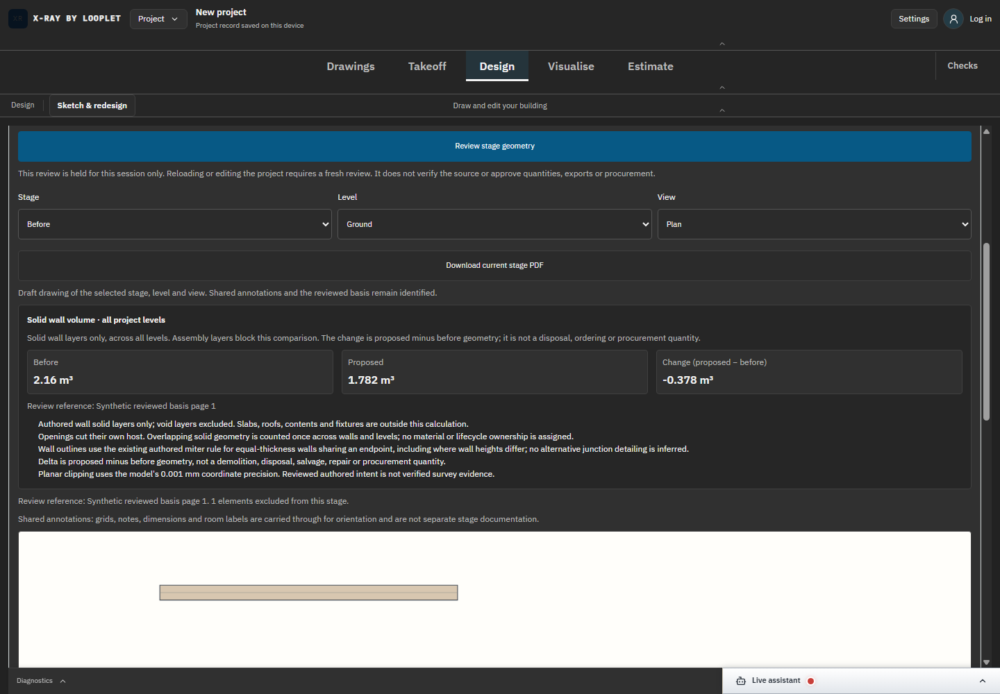
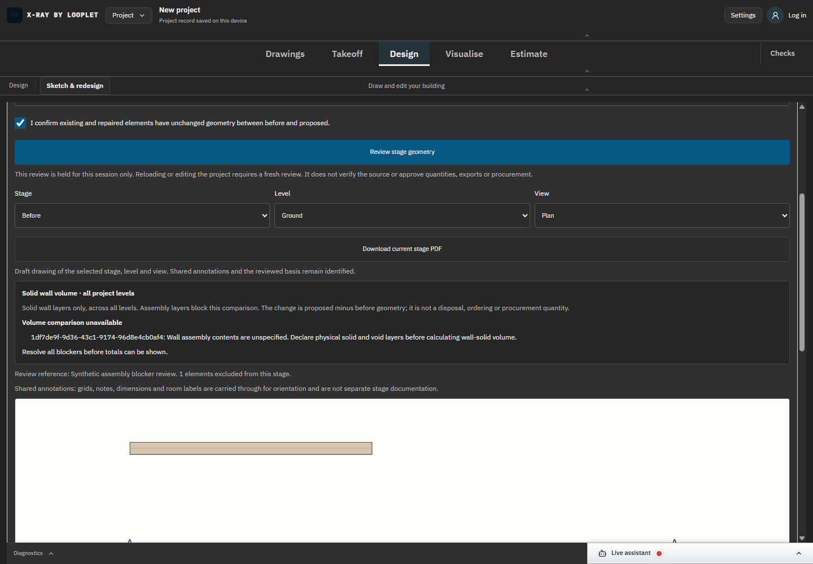

# SC-01 - Solid-wall stage comparison

Status: implemented and verified on DANS1; final integration build tracked in SC-06.

[Exact source diff](../source.diff): alterationQuantities.ts/test.ts. Before/proposed unions count overlapping solid geometry once across walls and levels. Void layers are excluded; unknown assemblies, stale/unresolved basis, sub-tolerance height bands and excessive clipping work return blockers without partial numbers.

The actual UI shows 2.16 m� before, 1.782 m� proposed and -0.378 m� signed geometry change. Screenshots are from the DANS1 58-operation development campaign and were visually inspected. ID swaps, overlapping elevations, openings, voids and calculation limits are established by [executed tests](../output-tests-final.log), not screenshots alone.

These are authored wall-solid volumes across all levels. They are not demolition, disposal, repair or procurement quantities; material synchronization remains blocked.
