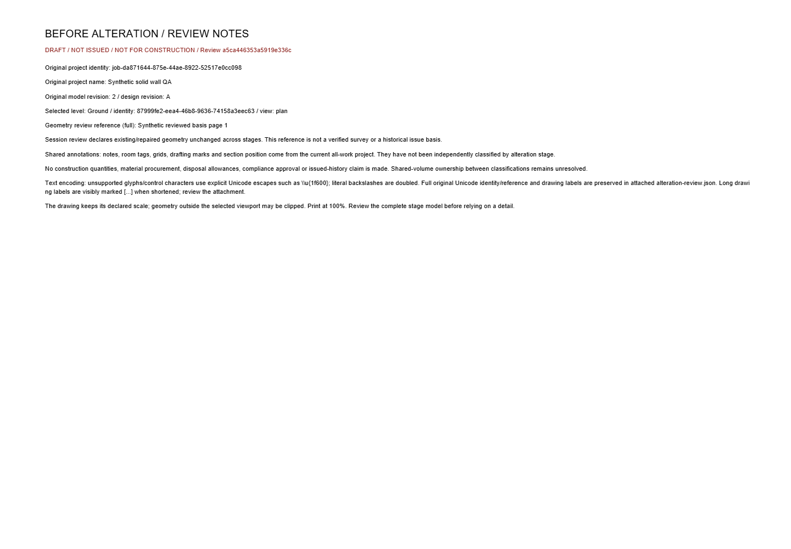
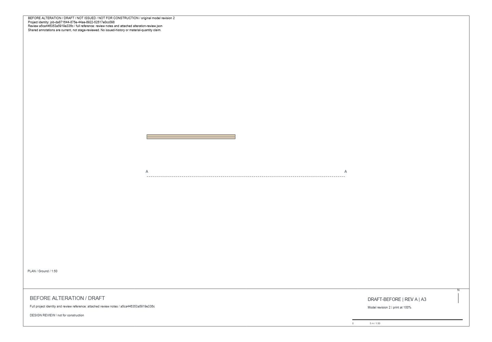

# SC-02 - Stage-labelled draft PDF

Status: normal-reference export implemented and visually verified; boundary Unicode visual check recorded in SC-04.

[Exact source diff](../source.diff): alterationExport.ts/test.ts. The selected stage, original project/revision, review identity and draft/shared-annotation status are visible. Full original Unicode reference and display labels remain attached as UTF-8 JSON. Declared drawing scale is preserved; this is not an issued drawing set.

These screenshots render the actual PDF captured from the UI download using PDF.js on DANS1. Root inspected both pages. [Browser receipts](../proof-quantity-export/browser-results.json) and [PDF content/immutability tests](../output-tests-final.log) establish the download and its metadata. The capture file and binding are retained alongside the screenshots.

The [500-character Unicode boundary](SC-04.md) also passed visual/content verification. [Actual captured stage PDF](../proof-quantity-export/sc02-actual-stage.pdf).
