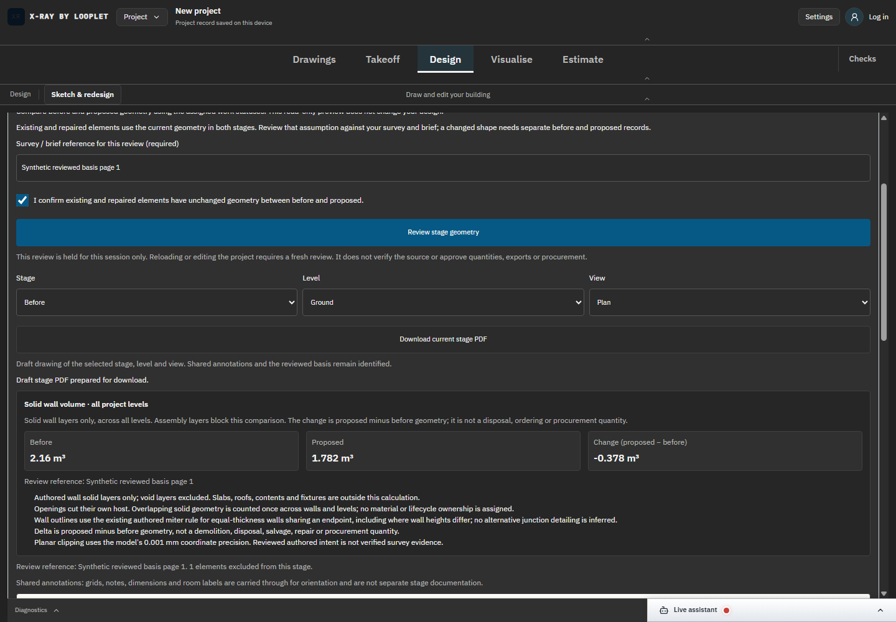
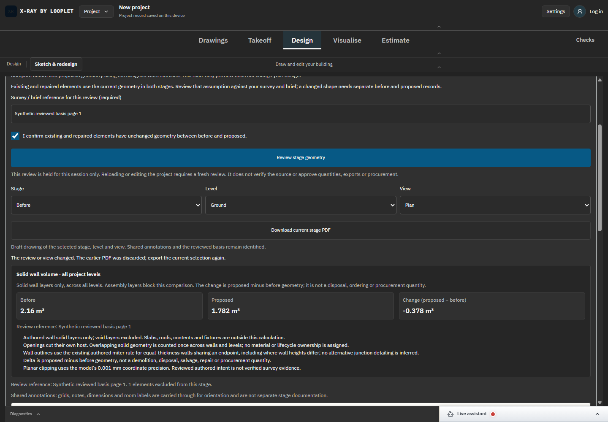

# SC-03 - Download and stale-output protection

Status: implemented and verified on DANS1; final production checks recorded separately.

[Exact source diff](../source.diff): AlterationStagePreview.tsx/alterationStagePreview.css. A current reviewed basis enables PDF export. The control reports progress/errors; selection epoch and current project/basis identity discard an earlier asynchronous result after a change, including change-and-back.

[58-operation browser receipts](../proof-quantity-export/browser-results.json) verify the actual UI messages and captured Blob/download outcome. Root inspected both states. Discarded bytes do not trigger a download; re-export is required for the current selection.
