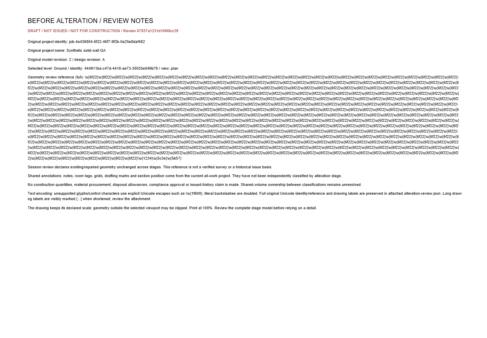

# SC-04 - Arithmetic, content and PDF boundary verification

Status: verified on DANS1. [Exact source diff](../source.diff).

Full regression: 201 script +1,293 TypeScript tests. A test-only PDFRawStream narrowing correction then passes 14/14 focused quantity/export tests and full typecheck. The initial diagnostic remains preserved.

- [Full regression](../output-regression.log)
- [Final focused tests](../output-tests-final.log)
- [Final typecheck/result](../output-result-final.json)
- [Unicode browser check, 34/34](../proof-unicode-export2/browser-results.json)

This screenshot establishes layout and the explicit Unicode-escape legend. Exact original Unicode values are verified in the PDF attachment by tests. The maximum reference fits one notes page; the second PDF page is the drawing. [Actual captured Unicode PDF](../proof-unicode-export2/sc02-actual-unicode-stage.pdf).

The first Unicode browser attempt used a misdecoded scenario string and was correctly rejected above the 500-character bound. The corrected ASCII-encoded scenario passes; the failed attempt is retained. No product validation was weakened.
