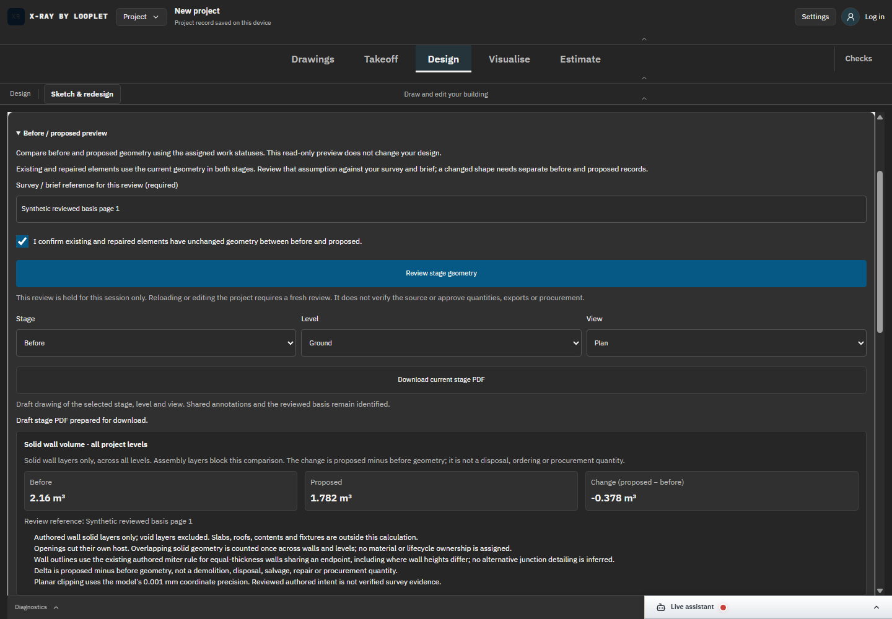
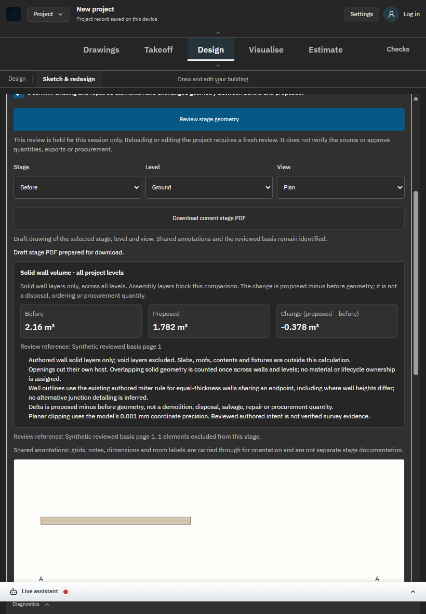

# SC-05 - Final desktop/tablet production interaction

Status: verified against actual f978f9103c27 built output on DANS1. [Exact source diff](../source.diff).

[52/52 production operations](../proof-quantity-production-final/browser-results.json) verify actual UI Restore of a labelled synthetic fixture, explicit review, exact displayed volumes, PDF download and stale change-and-back rejection. Root inspected the final tablet and built desktop images; the browser agent inspected the full set. Captured runtime errors are empty; task/browser/server cleanup is recorded alongside the screenshots.

[Actual final-build PDF](../proof-quantity-production-final/sc02-actual-built-stage.pdf). The first build also passed 52 operations, but its web bundle hashes differed from the same-source retry. The final campaign reran against the actual retry output; no equivalence was assumed.
