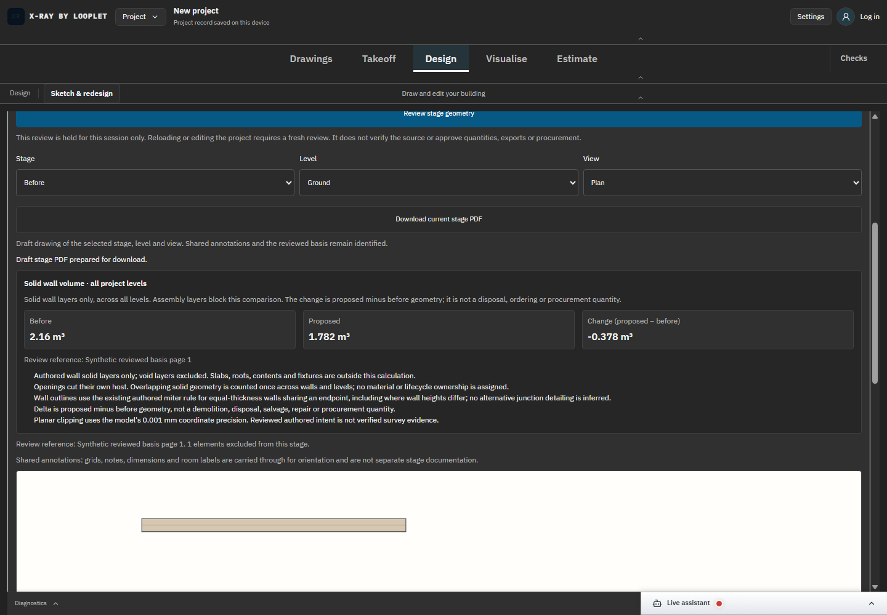

# SC-06 - Final regression and web/native build

Status: complete for this bounded source/build verification. Final web/typecheck/native NSIS build and production browser checks all passed.

[Exact product diff](../source.diff). Input archive f978f9103c2664b876887e9dd759ecfde7f9d4d4d97e4c10ee8d0fd10f143075 contains863 web inputs;106 native inputs are independently bound.

The screenshot proves the actual built UI rendered, not that compilation passed. [Full regression](../output-regression.log), [focused tests/typecheck result](../output-result-final.json), and [final production receipts](../proof-quantity-production-final/browser-results.json) provide their respective executed evidence.

First native attempt f978f9103c26 failed with LLVM out of memory; logs retained. Retry f978f9103c27 uses identical source inputs. [Bundle comparison](../build-comparison.json) found differing generated bundles, so production verification was repeated on f27. No unrelated process was stopped. Native application UI, installer execution and whole-industry acceptance remain separate.

[Final native completion](../build-f978f9103c27/native-completion.json): all gates exit0; native290.29seconds; worker reverified source hashes after packaging and exited0. No installation or deployment performed.
