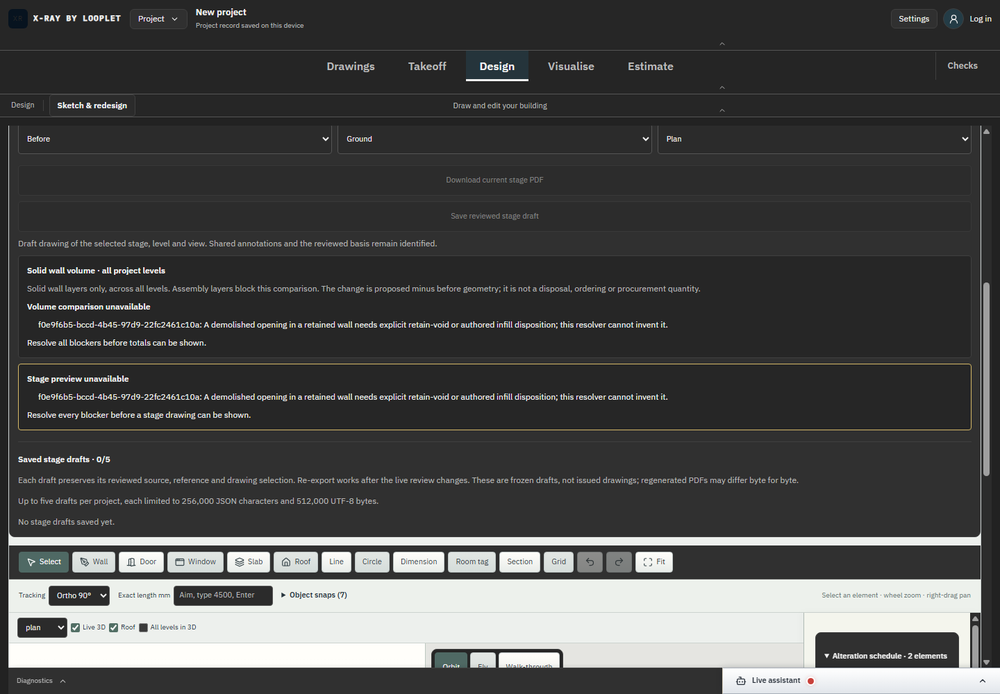
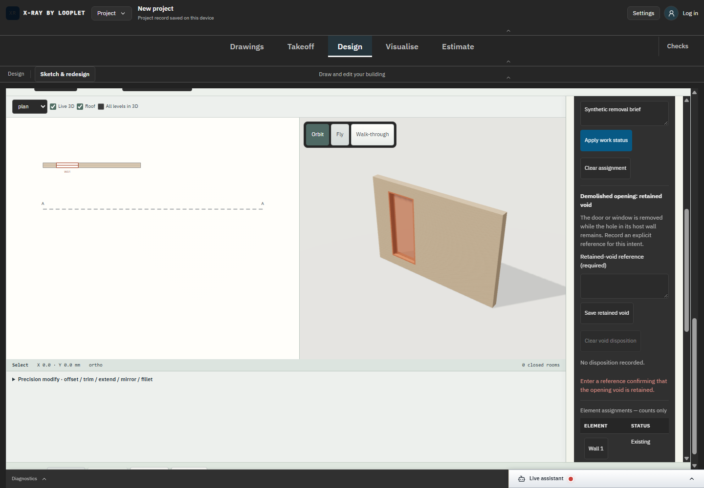
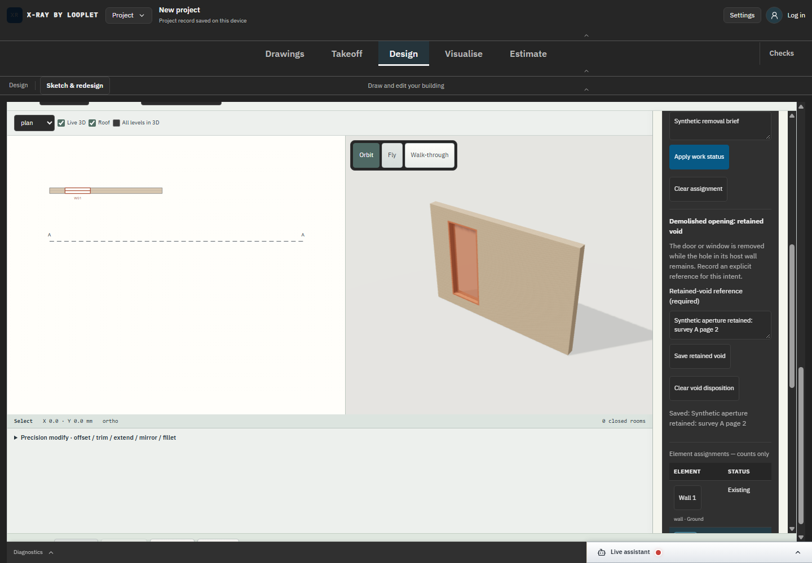

# SC-01 - Explicit retained opening intent

Status: complete for demolished fixture retain-void, with required supplied reference and strict invalid-input handling.

The screenshots show actual entry/blocking/saved UI states. Domain tests establish that missing/cleared intent blocks, changed work status clears intent, stale reviews reject, and a retained cut preserves solid wall geometry. Infill and altered repaired geometry remain open.
[Exact source diff](../source.diff), baseline be76fab on feat/architect-cad-engine. Authored geometry and supplied references remain unverified; no construction issue, procurement or compliance approval is implied.

Executed evidence: [DANS1 regression](../proof-retained-tests/regression.log) passes 201 script +1,314 TypeScript tests. [Final typecheck/focused result](../proof-retained-tests/result-final.json) passes after two type-only integration corrections. [100/100 browser receipts](../proof-retained-drafts/browser-results.json) and [DANS1/browser binding](../proof-retained-drafts/browser-run-binding.json) identify the actual dev campaign. Task/browser/server cleanup completed.