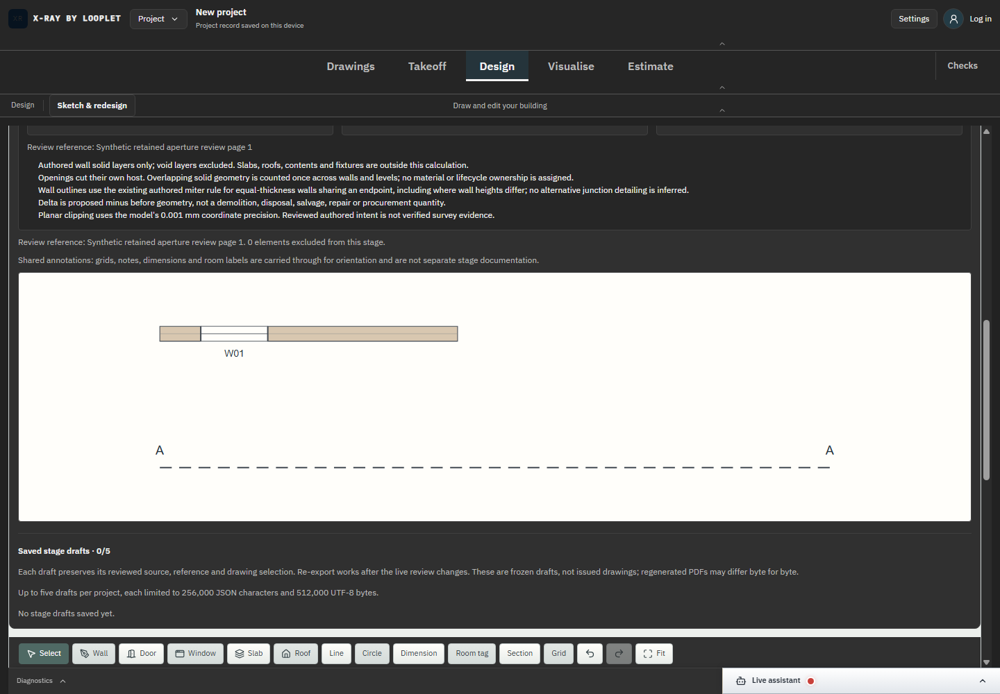
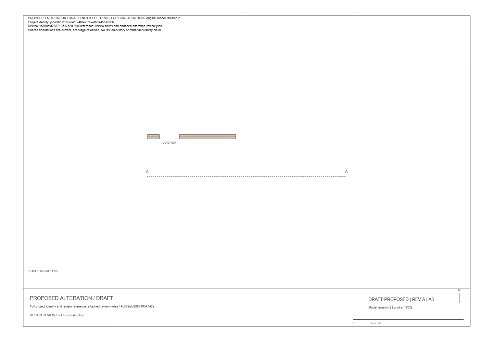
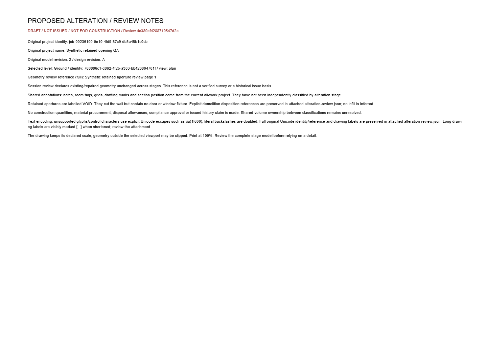

# SC-02 - Empty aperture rendering and draft export

Status: complete for before fixture/proposed empty aperture in this bounded workflow.

VOID identifies the empty cut. It has no door swing/window glazing; scene and IFC tests check no fixture object/fill relation. Door-height and elevated-window fixtures independently verify exact wall-cut volumes. PDF attachment retains original disposition reference and aperture IDs. The PDF is a selected-view draft, not a coordinated issued set.
[Exact source diff](../source.diff), baseline be76fab on feat/architect-cad-engine. Authored geometry and supplied references remain unverified; no construction issue, procurement or compliance approval is implied.

Executed evidence: [DANS1 regression](../proof-retained-tests/regression.log) passes 201 script +1,314 TypeScript tests. [Final typecheck/focused result](../proof-retained-tests/result-final.json) passes after two type-only integration corrections. [100/100 browser receipts](../proof-retained-drafts/browser-results.json) and [DANS1/browser binding](../proof-retained-drafts/browser-run-binding.json) identify the actual dev campaign. Task/browser/server cleanup completed.