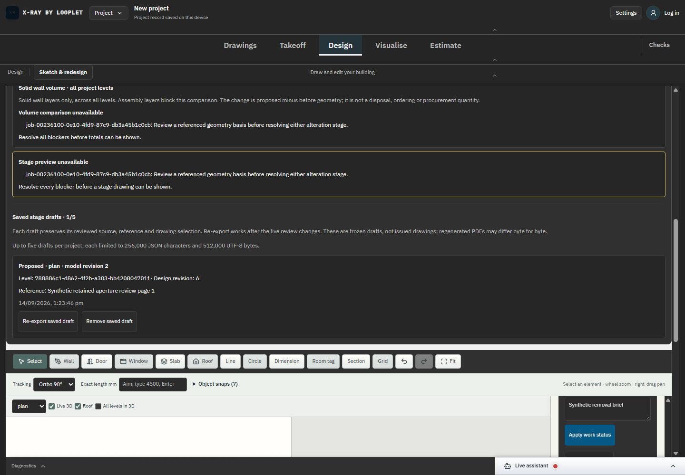
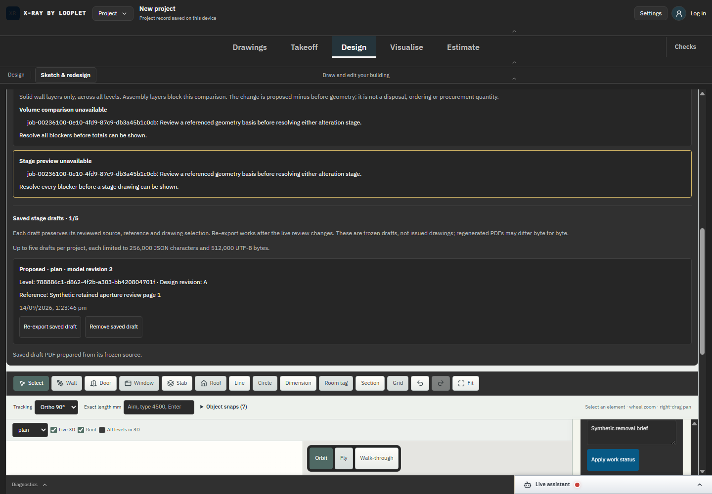
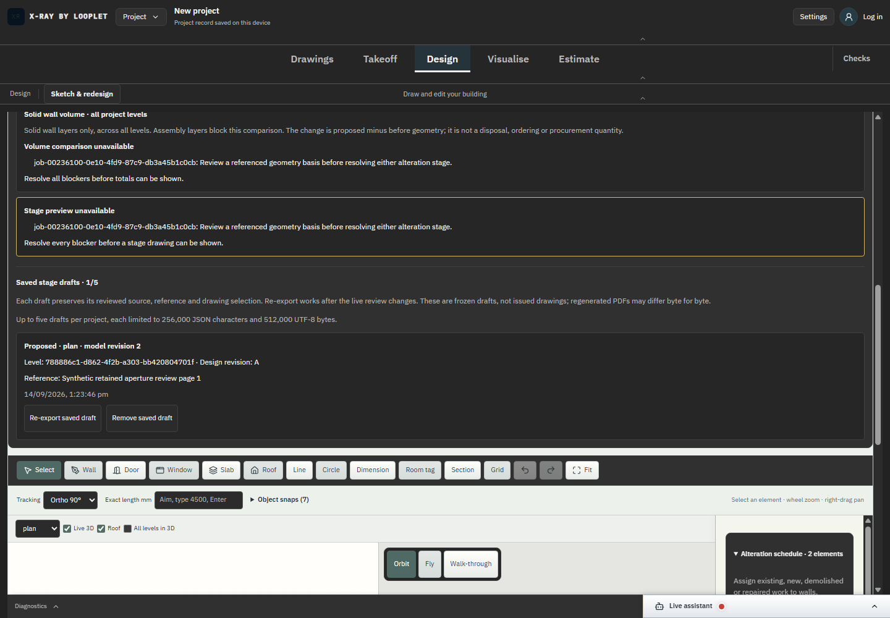
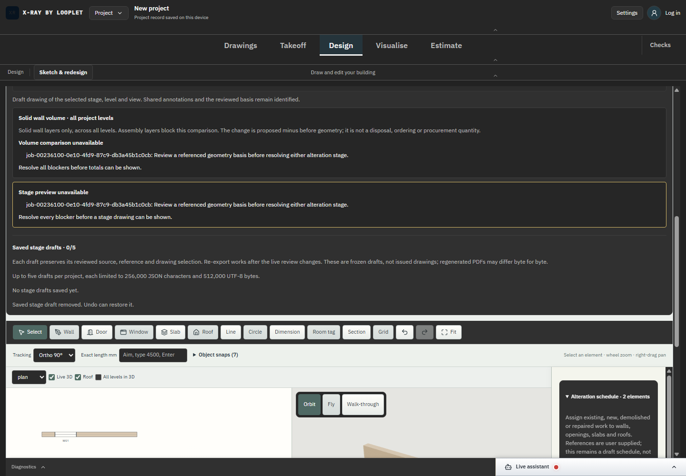
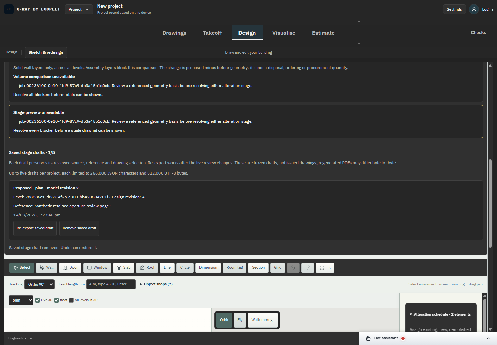
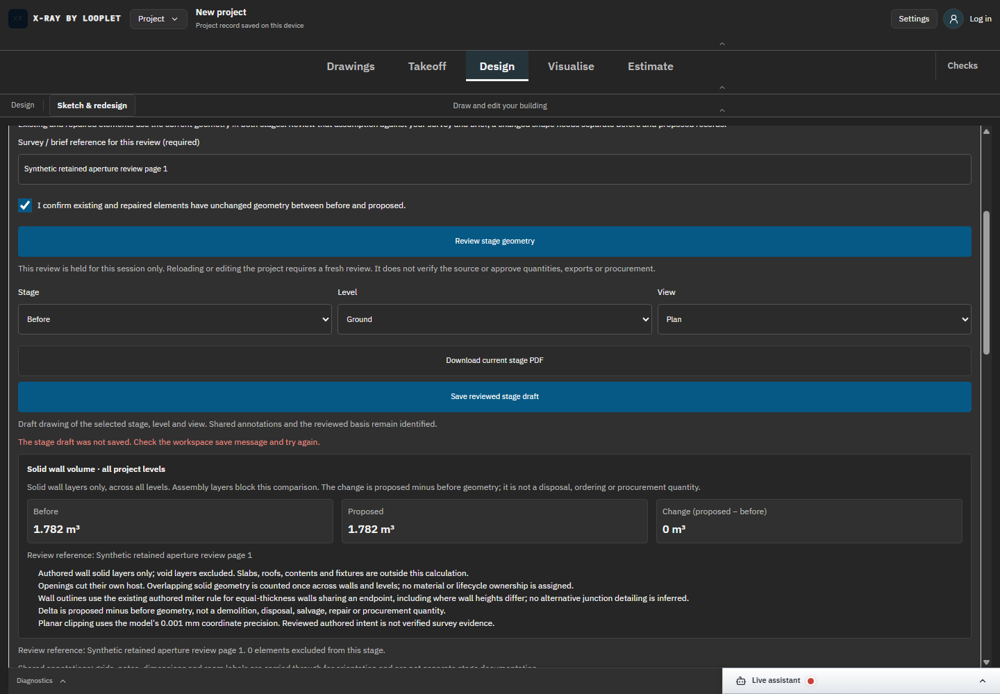

# SC-03 - Frozen saved drafts and persistence

Status: complete for bounded saved draft register, with up to five records and explicit size limits.

Actual browser readback checks frozen source after later live edits/reload, undoable removal and unchanged bytes when saving fails. Domain tests cover source SHA mismatch, nested-history rejection, identity/selection/revision checks, quotas and project isolation, including DXF import into another project. The source hash checks frozen bytes; it does not authenticate review approval. Re-export regenerates a PDF and does not promise byte-identical PDF files.
[Exact source diff](../source.diff), baseline be76fab on feat/architect-cad-engine. Authored geometry and supplied references remain unverified; no construction issue, procurement or compliance approval is implied.

Executed evidence: [DANS1 regression](../proof-retained-tests/regression.log) passes 201 script +1,314 TypeScript tests. [Final typecheck/focused result](../proof-retained-tests/result-final.json) passes after two type-only integration corrections. [100/100 browser receipts](../proof-retained-drafts/browser-results.json) and [DANS1/browser binding](../proof-retained-drafts/browser-run-binding.json) identify the actual dev campaign. Task/browser/server cleanup completed.