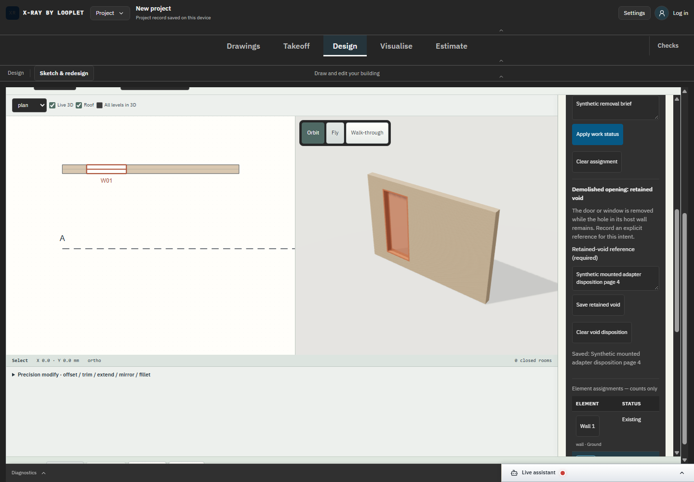

# SC-04 - Assistant operation and independent checks

Status: complete for deterministic controller execution and source review in this bounded batch. Live provider/Developer explanations remain open.

[Exact source diff](../source.diff). [Mounted adapter20/20 receipts](../proof-retained-adapter/browser-results.json) establish actual read/edit/read and saved localStorage readback through the mounted controller. The screenshot shows resulting intent/reference; it is not proof of an AI conversation. [DANS1/browser binding](../proof-retained-adapter/browser-run-binding.json) and cleanup files identify the executed campaign.

[Full regression](../proof-retained-tests/regression.log):201 script +1,314 TypeScript tests pass, including strict disposition inputs, revision/project binding, atomic failure, exact cuts, frozen draft corruption/size/quota/identity checks, DXF isolation, PDF metadata and IFC fixture exclusion. Initial typecheck found Inspector callback return type and canvas reference kind declarations incomplete; both type-only corrections passed [final typecheck](../proof-retained-tests/result-final.json) and8focused canvas tests. No numerical failures were hidden.

[Independent source review](../independent-review.md) records schema-cycle correction and final review. This is separate code review, not product Developer-mode acceptance or professional certification.