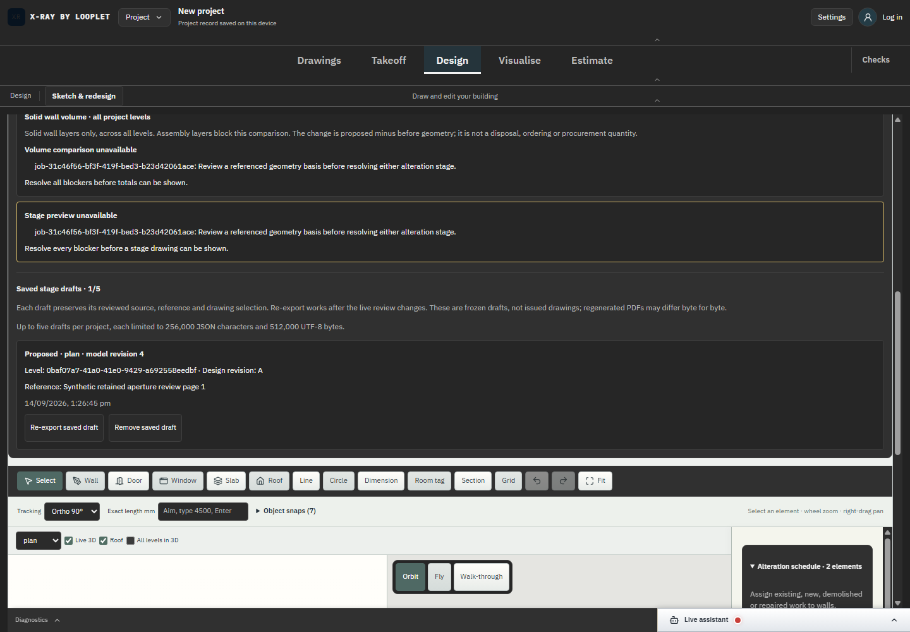

# SC-05 - Desktop and tablet production workflow

Status: complete for the bounded retained aperture/saved draft browser workflow.

[Exact source diff](../source.diff). [Production106/106 receipts](../proof-retained-drafts-production/browser-results.json), [host/browser binding](../proof-retained-drafts-production/browser-run-binding.json), [task source and preview binding](../proof-retained-drafts-production/task.ps1), [web build completion](../build-5b80085aab3f/completion.json).

Actual npm production preview from build5b80085aab3f exercised fixture/disposition entry, review, before/proposed rendering, equal wall-cut comparison, saving/re-exporting frozen drafts, reload, removal/undo, rejected storage write and desktop/tablet overflow checks. Root inspected both device screenshots and development PDF renders. The fast-CDP runner includes a generic development/no-release limitation string; the task path and build completion identify this actual production preview. No installation or native UI is implied.

Desktop1440x1000 and tablet820x1180 render checks pass with no captured page errors. These sizes do not establish macOS/Linux native support or complete industry workflow acceptance. Task/server/browser cleanup completed.