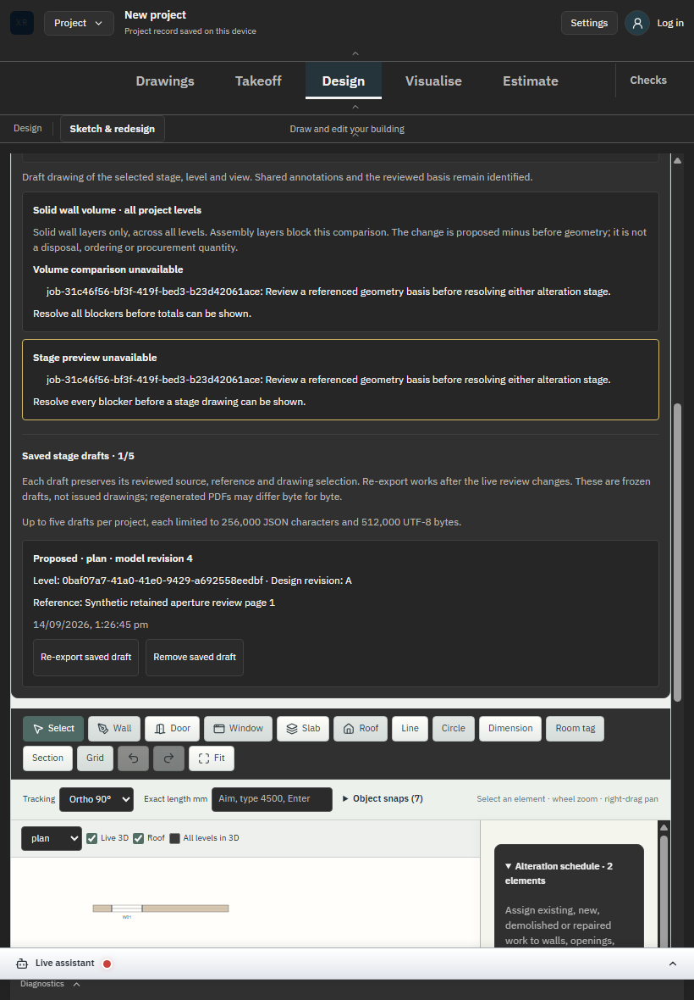

# SC-06 - Final regression, source and web/native build

Status: complete for this bounded build/package checkpoint; no installation or native UI claim.

[Exact product diff](../source.diff), baseline be76fab, branch feat/architect-cad-engine. Final source archive5b80085aab3fda80ebe95ad86e1966abd62ed12be775ea9b6092b21641940a3d contains868 web inputs;106 native inputs independently bound. [Final source check](../final-source-check.json) has zero mismatches.

[Native completion](../build-5b80085aab3f/native-completion.json) records all dependency/typecheck/focused/web/native gates exit0. Maintained DANS1 worker ran High priority/all16 processors, web then native sequentially. Native compilation/NSIS packaging took304.42seconds. Worker reverified source inputs and exited0; no retry was necessary.

[Regression1515 passing tests](../proof-retained-tests/regression.log), [final typecheck/focused8tests](../proof-retained-tests/result-final.json) and [actual production106/106 receipts](../proof-retained-drafts-production/browser-results.json) support separate claims. Screenshot proves built UI rendering, not successful compilation. [Final cleanup](../final-cleanup.json) confirms no owned build processes, test listeners or retained scheduled tasks.

Source and proof are checkpointed on the existing branch. Native UI/installer execution, macOS/Linux packages, coordinated issue sets and whole-industry acceptance remain open. No deployment, installation or merge performed.