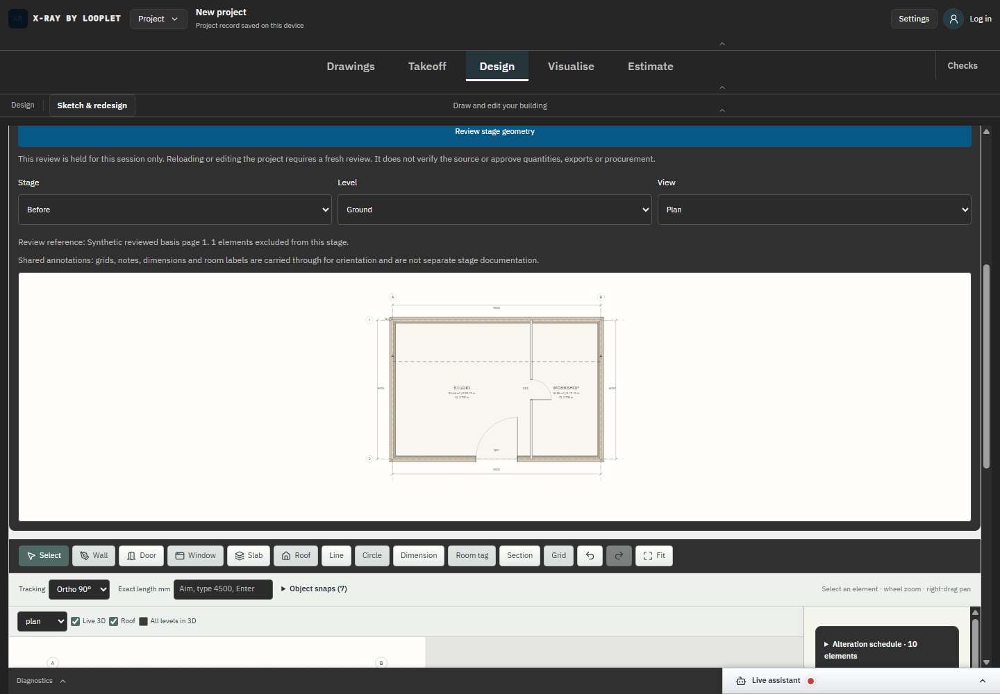

# SC-03 - Unresolved input protection

Status: completed bounded preview step; historical backfill, no new capture.

Source: commit a381ca8; [campaign scope](../README.md).

This is the accepted reviewed state only; blocker refusal is established by executed domain/browser checks, not this image.

[Executed evidence](../proof-stage2/browser-results.json). Original DANS1 capture/build identity d83b24da5ade is preserved.

No phase procurement, issued-set or whole-industry acceptance is implied.
