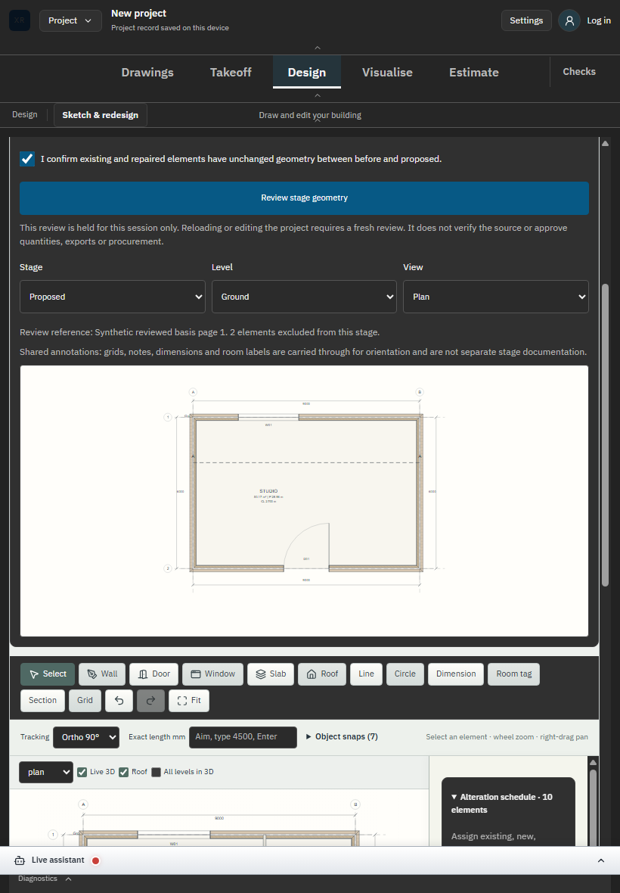

# SC-04 - Dependent geometry and six views

Status: completed bounded preview step; historical backfill, no new capture.

Source: commit a381ca8; [campaign scope](../README.md).

The demolished divider and hosted door are absent; all six view assertions are in the browser receipts.

[Executed evidence](../proof-stage-production/browser-results.json). Original DANS1 capture/build identity d83b24da5ade is preserved.

No phase procurement, issued-set or whole-industry acceptance is implied.
