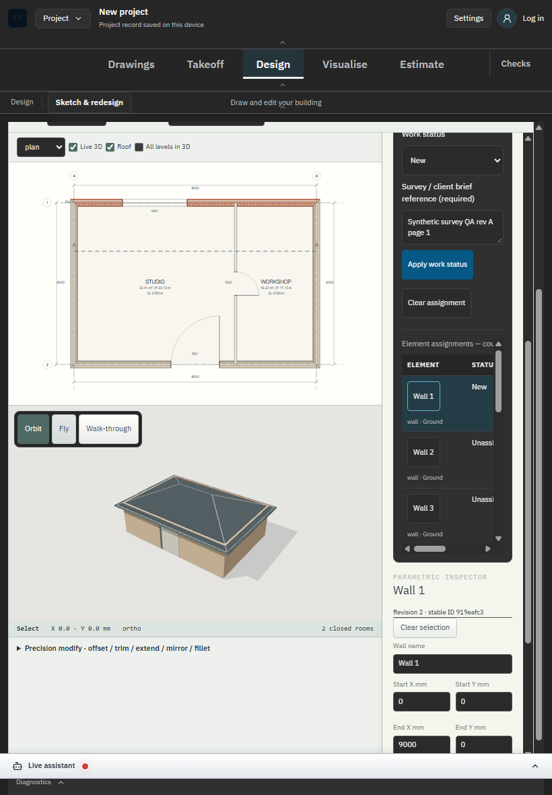

# SC-02 - Lifecycle assignment and schedule

Status: completed bounded lifecycle step; historical backfill, no new capture.

Source: commit f3e3a5c; [campaign source and scope](../README.md).

Assigned and unassigned schedule rows are legible in the verified charcoal theme.

[Executed evidence](../regression.log). The original screenshot directory retains its capture/source binding. Final lifecycle build: 20e1cd9705b0; development screenshots are not relabelled as production captures.

This does not close whole-industry acceptance or live assistant/Developer review.
