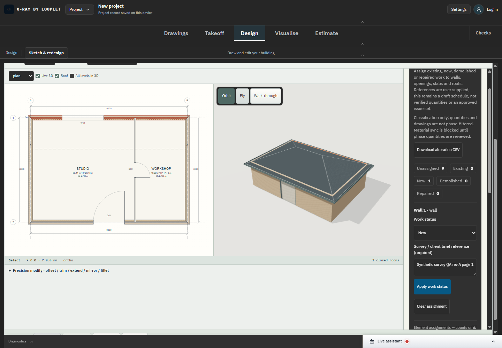

# SC-06 - Final lifecycle build verification

Status: completed bounded lifecycle step; historical backfill, no new capture.

Source: commit f3e3a5c; [campaign source and scope](../README.md).

The built-output UI renders. Web/native build completion is established by the linked machine result, not this screenshot.

[Executed evidence](../build-20e1cd9705b0/native-completion.json). The original screenshot directory retains its capture/source binding. Final lifecycle build: 20e1cd9705b0; development screenshots are not relabelled as production captures.

This does not close whole-industry acceptance or live assistant/Developer review.
