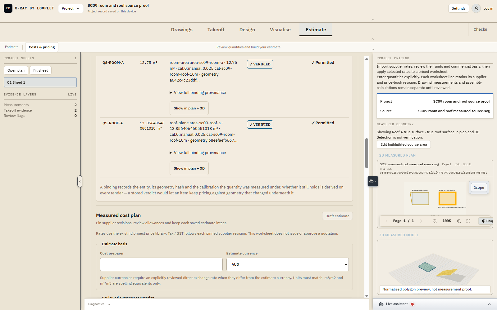

# SC09 room/roof machine-3: fresh corrected full machine gate

**PASS: fresh DANS1 execution, 2,032 / 2,032 tests, zero failures, full TypeScript check exit 0, scoped lint exit 0 with 16 warnings.** This is the new `machine-3` attempt, not reinterpreted machine-2 output.

The old parser incorrectly required `# tests/pass/fail` TAP lines although the actual stdout used `ℹ tests/pass/fail` spec summaries; the corrected parser reads UTF-8 and accepts both formats while rejecting partial, duplicate, malformed or failing blocks.

## Executed command and unchanged source

Daniel explicitly authorized the fresh full-gate rerun on the same frozen pack. The orchestration session exited **0**. Exact outer command:

```powershell
ssh tonys-test-pc powershell -NoProfile -NonInteractive -ExecutionPolicy Bypass -File C:/Users/danie/XRayBuilds/preflight/sc09rr-bf09e36e3100/qualify-machine3.ps1 -RunId sc09rr-bf09e36e3100 -ArchiveHash b44ac1a5a5a35d6602f1ae5cd0751c8dca080588dfddfbd9c1d7abd37fc26936 -ReuseSource -Attempt machine-3
```

The transferred `qualify-machine3.ps1` hash was independently read back from DANS1: `d4c874de43964e8b6c3292a122696abc50bc30895f16c7b0db54f34d115d2546`, matching the [changed helper](../infrastructure/qualify.ps1). Its [exact parser correction diff](../machine/parser-4/parser-change.patch) is SHA-256 `6b7bf69fb8ee2ddf579740fb8c014cbe284aa2ceee2f803a61988181fef05d26` against the previously proven spawn-3 helper.

[Fresh results](../machine/machine-3/results.json) and [remote stdout](../machine/machine-3.remote.stdout.log) both identify:

- Run `sc09rr-bf09e36e3100`, new sibling attempt `machine-3`, `host: DANS1`, `reusedSource: true`, 2,999 source files, matching dependency lock.
- Base HEAD `6477356316abcaee229b572dd5fc79d381b565cb`; changed SC-09 files are bound by the source snapshot, not claimed committed at that HEAD.
- Source digest `bf09e36e3100a5cfa9ef4565892edc8e28fdb791a3ec9341375af7fd91394e55` and archive SHA-256 `b44ac1a5a5a35d6602f1ae5cd0751c8dca080588dfddfbd9c1d7abd37fc26936`, identical to machine-2. No new run ID, source repack or product edit was used for this rerun.

Exact product source diff: [sc09-room-roof.patch](../source/sc09-room-roof.patch), SHA-256 `4d43f7097bd0342a017e532eabe6e1cf79404d423408683b2f4eb54f0e3e0111`. Its [manifest](../source/sc09-room-roof.manifest.json), SHA-256 `d68f560e3eefceb4c633c903331e9a340f577aba178423e98dddb6450bf2d755`, lists the 24 scoped changed files (12 modified, 12 new), all independently matched to the frozen snapshot during packaging; the non-mutating reverse-apply check passed.

## Recorded execution

Each command receipt contains its exact executable and complete argument list. All seven receipt objects were checked against the aggregate and matched.

| Command evidence | Fresh outcome |
| --- | --- |
| [Master-plan verifier receipt](../machine/machine-3/serial/verify-master-plan/receipt.json), [stdout](../machine/machine-3/serial/verify-master-plan/stdout.log) | PASS, exit 0 |
| [BOM-goldens verifier receipt](../machine/machine-3/serial/verify-bom-goldens/receipt.json), [stdout](../machine/machine-3/serial/verify-bom-goldens/stdout.log) | PASS, exit 0 |
| [Batch 01 receipt](../machine/machine-3/parallel/test-batch-01/receipt.json), [stdout](../machine/machine-3/parallel/test-batch-01/stdout.log) | PASS, exit 0, 203 / 203 |
| [Batch 02 receipt](../machine/machine-3/parallel/test-batch-02/receipt.json), [stdout](../machine/machine-3/parallel/test-batch-02/stdout.log) | PASS, exit 0, 858 / 858 |
| [Batch 03 receipt](../machine/machine-3/parallel/test-batch-03/receipt.json), [stdout](../machine/machine-3/parallel/test-batch-03/stdout.log) | PASS, exit 0, 971 / 971 |
| [Full `tsc --noEmit` receipt](../machine/machine-3/parallel/typecheck/receipt.json), [stdout](../machine/machine-3/parallel/typecheck/stdout.log) | PASS, exit 0, empty stdout/stderr |
| [Scoped ESLint receipt](../machine/machine-3/serial/scoped-lint/receipt.json), [stdout](../machine/machine-3/serial/scoped-lint/stdout.log) | PASS, exit 0, **0 errors / 16 warnings** |

The three stdout summaries independently confirm **203 + 858 + 971 = 2,032**; each reports zero fail, cancelled, skipped and todo. All three fresh test receipts now have `testCountsAvailable: true` and `testCountBasis: "stdout TAP/spec summary"`. The aggregate has `countsAvailable: true`, `tests: 2032`, `pass: 2032`, `fail: 0`, `verdict: PASS`, and `error: null`. These are executed test counts, not catalogue-completion counts.

Every command records `processExited: true`, `timedOut: false`, `allOwnedProcessesExited: true`, an empty errors list and zero cleanup actions. At **2026-09-19 UTC**, the master-plan verifier finished `16:56:04.6831596Z`, before BOM started `16:56:10.1170822Z`; BOM finished `16:56:10.7728839Z`, before the earliest parallel start `16:56:16.1958145Z`. The parallel wave ended with typecheck at `16:56:43.7870489Z`; lint then ran `16:56:46.6118366Z`–`16:56:48.3594714Z`. Shared-output verifiers did not overlap the parallel wave.

The scoped lint warnings remain exactly as [previously enumerated](SC09RR-MACHINE-02.md#lint-warnings-retained): ten fast-refresh export warnings in `QSCostPlanPackagePanel.tsx` and `QSWorksheet.tsx`, plus six unused-symbol warnings in `QSItemBindingLedger.tsx`, `QSReportPanel.tsx`, `assistantTool.test.ts` and `qsReportFormatter.ts`. The new lint stdout hash equals the old lint stdout hash, `bd51892dbab427112fcc9e193f264d01361aa122af74f2dc4165db34bf8aec7d`. This is not a zero-warning or whole-repository-lint claim.

## Preserved old FAIL and verified new artifacts

After the fresh run, this audit again recomputed sizes and SHA-256 hashes for **all 29 machine-2 manifest entries**: 29 unchanged, zero mismatches, 874,594 bytes. The [old results](../machine/machine-2/results.json) remain **FAIL**, with null full-test aggregate and the original parser error. No original output was rewritten.

All **29 machine-3 manifest entries** also matched: zero mismatches, 633,081 bytes. Key hashes:

| Evidence | SHA-256 |
| --- | --- |
| [Old FAIL results](../machine/machine-2/results.json) | `6fba30625cc19aebbe6620fe6136947c90af75801b01d05614983d4d0027f400` |
| [Old manifest](../machine/machine-2/sha256-manifest.json) | `2721406e14a156c1f8fa4ad6c2e3080714890865d3212cc0284a3773a0463d38` |
| [Fresh PASS results](../machine/machine-3/results.json) | `d04735a2751c5a641c7dee77c7c47d94b5ef684e7bc3f8fc0b325706533c3e80` |
| [Fresh manifest](../machine/machine-3/sha256-manifest.json) | `0ed658efc57c6d5843ac28bce211d225065a1b2c7855d445c83706af10c34801` |
| [Remote stdout](../machine/machine-3.remote.stdout.log) | `9dfe91c09db12fcced89118850453d93d51e2c3c374f47aa0bf5419851633e62` |
| [Remote stderr, empty](../machine/machine-3.remote.stderr.log) | `e3b0c44298fc1c149afbf4c8996fb92427ae41e4649b934ca495991b7852b855` |

## Separate parser check and visual context

The [parser-only verification record](../machine/parser-4/README.md) separately documents 11 synthetic cases and actual aggregate-statement checks on DANS1, including clean entirely absent summaries with null counts and rejection of incomplete, duplicate, malformed, failing and nonzero-exit cases. Its derived PASS reprocessed existing logs; **it is not this fresh machine-3 execution** and is not added to the 2,032 test count. Its first diff-packaging failure remains preserved.



The accompanying inspected **dev4 screenshot** (SHA-256 `05e5479fbc0cd6304f43d669d867a6e1f584105a83aa72dcd3c9bea9bee8f66e`) shows the room/roof binding UI and highlighted roof in plan/normalized 3D. It supplies work-context imagery only: it does **not** show or prove CLI execution, parser correctness or measurement arithmetic. The executed receipts above prove the machine result; [browser proof is recorded separately](SC09RR-BROWSER-DIAGNOSTIC-04.md).

This record makes no production-build, deployed/native/live-device or overall SC-09 completion claim. It changes no ledger, dashboard, catalogue row, product source or helper.
